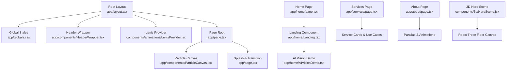
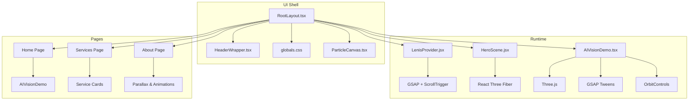
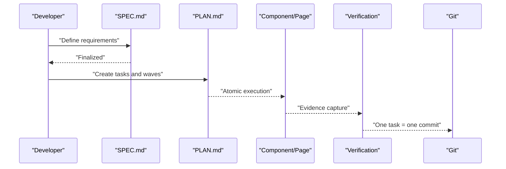
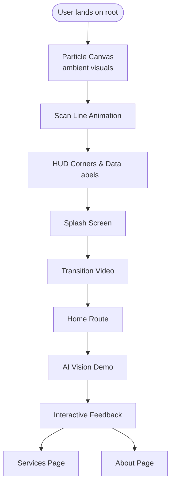
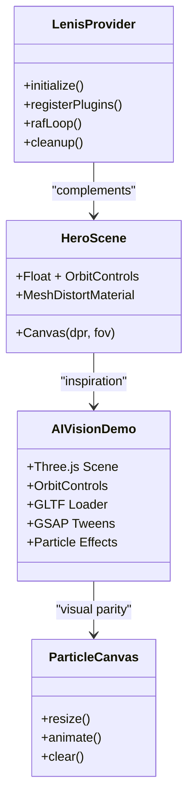
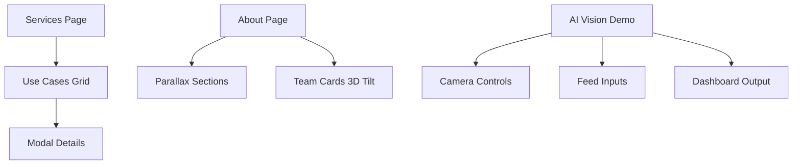
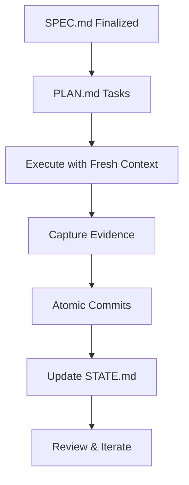
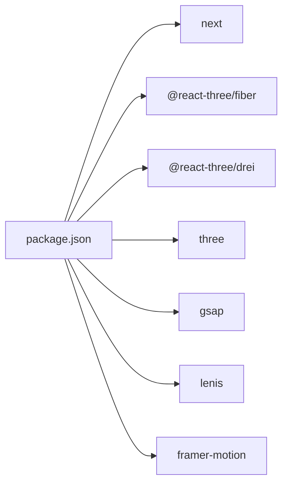

# Design Philosophy & Approach

<cite>
**Referenced Files in This Document**
- [README.md](file://README.md)
- [PROJECT_RULES.md](file://PROJECT_RULES.md)
- [GSD-STYLE.md](file://GSD-STYLE.md)
- [package.json](file://package.json)
- [app/layout.tsx](file://app/layout.tsx)
- [app/page.tsx](file://app/page.tsx)
- [app/components/ParticleCanvas.tsx](file://app/components/ParticleCanvas.tsx)
- [app/components/HeaderWrapper.tsx](file://app/components/HeaderWrapper.tsx)
- [components/animations/LenisProvider.jsx](file://components/animations/LenisProvider.jsx)
- [components/3d/HeroScene.jsx](file://components/3d/HeroScene.jsx)
- [app/home/AIVisionDemo.tsx](file://app/home/AIVisionDemo.tsx)
- [app/home/page.tsx](file://app/home/page.tsx)
- [app/services/page.tsx](file://app/services/page.tsx)
- [app/about/page.tsx](file://app/about/page.tsx)
- [app/globals.css](file://app/globals.css)
</cite>

## Table of Contents
1. [Introduction](#introduction)
2. [Project Structure](#project-structure)
3. [Core Components](#core-components)
4. [Architecture Overview](#architecture-overview)
5. [Detailed Component Analysis](#detailed-component-analysis)
6. [Dependency Analysis](#dependency-analysis)
7. [Performance Considerations](#performance-considerations)
8. [Troubleshooting Guide](#troubleshooting-guide)
9. [Conclusion](#conclusion)

## Introduction
This document explains the design philosophy and approach behind the Zeex AI Main Website. The project’s core principle “Stop vibecoding. Start shipping.” drives a pragmatic, reliable methodology centered on consistency, empirical validation, and smooth user experiences. The GSD (Get Shit Done) methodology is integrated to transform AI-assisted development into repeatable, high-quality outcomes. The website emphasizes performance, interactivity, and clear demonstrations of AI capabilities through immersive digital experiences. Architecturally, it prioritizes modern web standards, 3D optimization, and smooth animations. Content strategy focuses on showcasing surveillance and security solutions via engaging, interactive demos. Quality standards and validation processes ensure consistent performance across devices and browsers, with a strong commitment to accessibility, performance optimization, and maintainable code architecture.

## Project Structure
The website is a Next.js application with a clear separation of concerns:
- Application shell and global styles are defined in the root layout and global CSS.
- Pages are organized by feature (home, services, about, etc.), each with dedicated components and styles.
- Interactive experiences include a particle canvas, scroll-driven animations via Lenis, and 3D scenes powered by React Three Fiber.
- The AI Vision Demo is a self-contained component that showcases 3D camera modeling, particle effects, and interactive data feeds.

**Diagram sources**
- [app/layout.tsx:1-24](file://app/layout.tsx#L1-L24)
- [app/globals.css:1-120](file://app/globals.css#L1-L120)
- [app/components/HeaderWrapper.tsx:1-25](file://app/components/HeaderWrapper.tsx#L1-L25)
- [components/animations/LenisProvider.jsx:1-52](file://components/animations/LenisProvider.jsx#L1-L52)
- [app/page.tsx:1-55](file://app/page.tsx#L1-L55)
- [app/components/ParticleCanvas.tsx:1-71](file://app/components/ParticleCanvas.tsx#L1-L71)
- [app/home/page.tsx:1-15](file://app/home/page.tsx#L1-L15)
- [app/home/AIVisionDemo.tsx:1-562](file://app/home/AIVisionDemo.tsx#L1-L562)
- [app/services/page.tsx:1-379](file://app/services/page.tsx#L1-L379)
- [app/about/page.tsx:1-298](file://app/about/page.tsx#L1-L298)
- [components/3d/HeroScene.jsx:1-37](file://components/3d/HeroScene.jsx#L1-L37)

**Section sources**
- [app/layout.tsx:1-24](file://app/layout.tsx#L1-L24)
- [app/globals.css:1-120](file://app/globals.css#L1-L120)
- [app/page.tsx:1-55](file://app/page.tsx#L1-L55)

## Core Components
- Root Layout and Providers: Sets metadata, injects Lenis scroll smoothing, and wraps the app with a header and page root.
- Global Styles: Establishes a cohesive dark theme, typography, and reusable animations for HUD, grid overlays, scan lines, and particle effects.
- Header Wrapper: Conditionally renders the navigation header based on the current route.
- Particle Canvas: Lightweight canvas-based particle system for ambient visuals.
- AI Vision Demo: A comprehensive 3D demo showcasing a surveillance camera model, animated controls, particle transitions, and simulated AI processing pipeline.
- Scroll and Interaction Providers: Lenis for smooth scrolling and GSAP for advanced animations and ScrollTrigger integration.
- 3D Hero Scene: A lightweight, floating 3D sphere with subtle material distortion to reinforce brand identity.

These components collectively embody the philosophy of “Stop vibecoding. Start shipping.” by delivering polished, performant, and demonstrable experiences grounded in modern web standards and validated interactions.

**Section sources**
- [app/layout.tsx:1-24](file://app/layout.tsx#L1-L24)
- [app/globals.css:1-800](file://app/globals.css#L1-L800)
- [app/components/HeaderWrapper.tsx:1-25](file://app/components/HeaderWrapper.tsx#L1-L25)
- [app/components/ParticleCanvas.tsx:1-71](file://app/components/ParticleCanvas.tsx#L1-L71)
- [components/animations/LenisProvider.jsx:1-52](file://components/animations/LenisProvider.jsx#L1-L52)
- [components/3d/HeroScene.jsx:1-37](file://components/3d/HeroScene.jsx#L1-L37)
- [app/home/AIVisionDemo.tsx:1-562](file://app/home/AIVisionDemo.tsx#L1-L562)

## Architecture Overview
The architecture blends Next.js server-rendered pages with client-side interactivity. Providers encapsulate scroll behavior and 3D rendering, while individual pages orchestrate domain-specific experiences. The AI Vision Demo is a self-contained module that manages its own lifecycle, resources, and animations, reflecting the GSD emphasis on atomic, verifiable units of functionality.

**Diagram sources**
- [components/animations/LenisProvider.jsx:1-52](file://components/animations/LenisProvider.jsx#L1-L52)
- [components/3d/HeroScene.jsx:1-37](file://components/3d/HeroScene.jsx#L1-L37)
- [app/home/AIVisionDemo.tsx:1-562](file://app/home/AIVisionDemo.tsx#L1-L562)
- [app/layout.tsx:1-24](file://app/layout.tsx#L1-L24)
- [app/components/ParticleCanvas.tsx:1-71](file://app/components/ParticleCanvas.tsx#L1-L71)
- [app/services/page.tsx:1-379](file://app/services/page.tsx#L1-L379)
- [app/about/page.tsx:1-298](file://app/about/page.tsx#L1-L298)

## Detailed Component Analysis

### GSD Methodology Integration
The project adheres to the GSD protocol: SPEC → PLAN → EXECUTE → VERIFY → COMMIT. This manifests in:
- Speculative readiness: The website’s content and demos are designed to be demonstrable and verifiable, aligning with the “SPEC” requirement for clarity and completeness.
- Plan-driven execution: Pages and components are structured as modular, atomic units that can be planned, implemented, and validated independently.
- Empirical verification: The AI Vision Demo captures user interactions and simulates outcomes, providing observable evidence of functionality.
- Atomic commits: Each component and page is versioned as a unit of work, supporting reproducibility and traceability.

**Diagram sources**
- [README.md:147-178](file://README.md#L147-L178)
- [PROJECT_RULES.md:9-18](file://PROJECT_RULES.md#L9-L18)
- [GSD-STYLE.md:265-273](file://GSD-STYLE.md#L265-L273)

**Section sources**
- [README.md:147-178](file://README.md#L147-L178)
- [PROJECT_RULES.md:9-18](file://PROJECT_RULES.md#L9-L18)
- [GSD-STYLE.md:265-273](file://GSD-STYLE.md#L265-L273)

### User Experience Philosophy: Performance, Interactivity, and Demonstration
The website prioritizes:
- Performance: Canvas-based particle system, device pixel ratio-aware 3D rendering, and lazy initialization of heavy providers.
- Interactivity: Lenis scroll smoothing, GSAP-driven animations, and responsive 3D controls.
- Demonstration: The AI Vision Demo visually communicates AI capabilities through realistic camera movement, particle transitions, and dashboard-like feedback.

**Diagram sources**
- [app/page.tsx:1-55](file://app/page.tsx#L1-L55)
- [app/components/ParticleCanvas.tsx:1-71](file://app/components/ParticleCanvas.tsx#L1-L71)
- [app/globals.css:76-112](file://app/globals.css#L76-L112)
- [app/home/AIVisionDemo.tsx:1-562](file://app/home/AIVisionDemo.tsx#L1-L562)
- [app/services/page.tsx:1-379](file://app/services/page.tsx#L1-L379)
- [app/about/page.tsx:1-298](file://app/about/page.tsx#L1-L298)

**Section sources**
- [app/page.tsx:1-55](file://app/page.tsx#L1-L55)
- [app/globals.css:76-112](file://app/globals.css#L76-L112)
- [app/home/AIVisionDemo.tsx:1-562](file://app/home/AIVisionDemo.tsx#L1-L562)

### Architectural Approach: Modern Web Standards, 3D Optimization, Smooth Animations
- Modern web standards: Next.js App Router, React client directives, and CSS-in-JS-friendly globals.
- 3D optimization: Device pixel ratio clamping, selective rendering, and material tuning for performance.
- Smooth animations: Lenis for natural scroll behavior and GSAP for precise, composable animations.

**Diagram sources**
- [components/animations/LenisProvider.jsx:1-52](file://components/animations/LenisProvider.jsx#L1-L52)
- [components/3d/HeroScene.jsx:1-37](file://components/3d/HeroScene.jsx#L1-L37)
- [app/home/AIVisionDemo.tsx:1-562](file://app/home/AIVisionDemo.tsx#L1-L562)
- [app/components/ParticleCanvas.tsx:1-71](file://app/components/ParticleCanvas.tsx#L1-L71)

**Section sources**
- [components/animations/LenisProvider.jsx:1-52](file://components/animations/LenisProvider.jsx#L1-L52)
- [components/3d/HeroScene.jsx:1-37](file://components/3d/HeroScene.jsx#L1-L37)
- [app/home/AIVisionDemo.tsx:1-562](file://app/home/AIVisionDemo.tsx#L1-L562)
- [app/components/ParticleCanvas.tsx:1-71](file://app/components/ParticleCanvas.tsx#L1-L71)

### Content Strategy: Immersive Digital Experiences for Surveillance and Security
The Services and About pages demonstrate tailored messaging and use cases, while the AI Vision Demo immersively illustrates how AI-powered surveillance operates in practice. The design emphasizes clarity, interactivity, and trust through observable outcomes.

**Diagram sources**
- [app/services/page.tsx:1-379](file://app/services/page.tsx#L1-L379)
- [app/about/page.tsx:1-298](file://app/about/page.tsx#L1-L298)
- [app/home/AIVisionDemo.tsx:1-562](file://app/home/AIVisionDemo.tsx#L1-L562)

**Section sources**
- [app/services/page.tsx:1-379](file://app/services/page.tsx#L1-L379)
- [app/about/page.tsx:1-298](file://app/about/page.tsx#L1-L298)
- [app/home/AIVisionDemo.tsx:1-562](file://app/home/AIVisionDemo.tsx#L1-L562)

### Quality Standards and Validation Processes
- Consistency: GSD-style XML task structure and fresh-context execution minimize hallucinations and ensure reproducible outcomes.
- Empirical validation: Every change requires verifiable evidence (screenshots, command outputs, test results).
- Context hygiene: State snapshots and token efficiency rules prevent context degradation.
- Accessibility: Maintain readable contrast, semantic markup, and keyboard-friendly interactions.
- Browser/device parity: Device pixel ratio adjustments, graceful fallbacks, and responsive layouts.

**Diagram sources**
- [PROJECT_RULES.md:19-38](file://PROJECT_RULES.md#L19-L38)
- [GSD-STYLE.md:128-152](file://GSD-STYLE.md#L128-L152)

**Section sources**
- [PROJECT_RULES.md:19-38](file://PROJECT_RULES.md#L19-L38)
- [GSD-STYLE.md:128-152](file://GSD-STYLE.md#L128-L152)

## Dependency Analysis
External libraries and their roles:
- next: App shell and routing.
- @react-three/fiber and @react-three/drei: 3D rendering and helpers.
- three: Core 3D engine and loaders.
- gsap: Advanced animations and ScrollTrigger.
- lenis: Smooth scroll behavior.
- framer-motion: Motion primitives (used in hero buttons).

**Diagram sources**
- [package.json:11-21](file://package.json#L11-L21)

**Section sources**
- [package.json:11-21](file://package.json#L11-L21)

## Performance Considerations
- 3D Rendering: Clamp devicePixelRatio to balance quality and performance; prefer selective updates and dispose of resources on unmount.
- Animations: Use requestAnimationFrame and cancel on cleanup; avoid layout thrashing by batching DOM reads/writes.
- Canvas: Clear to transparent and reset composite operations to prevent residual artifacts.
- Lazy Providers: Defer heavy providers to client-only components to reduce initial bundle size.
- CSS: Prefer hardware-accelerated properties (transform, opacity) and avoid expensive filters where possible.

[No sources needed since this section provides general guidance]

## Troubleshooting Guide
- Scroll jank: Ensure Lenis is initialized after dynamic imports and plugins are registered; verify RAF loop is canceled on unmount.
- 3D scene issues: Confirm devicePixelRatio clamp and resize handlers; validate GLTF loader fallback behavior.
- Animation glitches: Check GSAP plugin registration order and ensure ScrollTrigger is updated in the RAF loop.
- Canvas artifacts: Clear the canvas with a transparent fill and restore context before drawing.
- Header visibility: Confirm pathname-based logic in HeaderWrapper and CSS class toggling.

**Section sources**
- [components/animations/LenisProvider.jsx:12-48](file://components/animations/LenisProvider.jsx#L12-L48)
- [app/home/AIVisionDemo.tsx:156-213](file://app/home/AIVisionDemo.tsx#L156-L213)
- [app/components/ParticleCanvas.tsx:40-67](file://app/components/ParticleCanvas.tsx#L40-L67)
- [app/components/HeaderWrapper.tsx:7-24](file://app/components/HeaderWrapper.tsx#L7-L24)

## Conclusion
The Zeex AI Main Website embodies a pragmatic, reliable approach to building immersive, AI-driven experiences. By integrating the GSD methodology, the project ensures consistent, verifiable outcomes while prioritizing performance, interactivity, and accessibility. The architecture leverages modern web standards, optimized 3D rendering, and smooth animations to deliver compelling demonstrations of surveillance and security solutions. Through disciplined quality practices and a focus on observable results, the site reflects the core philosophy: “Stop vibecoding. Start shipping.”