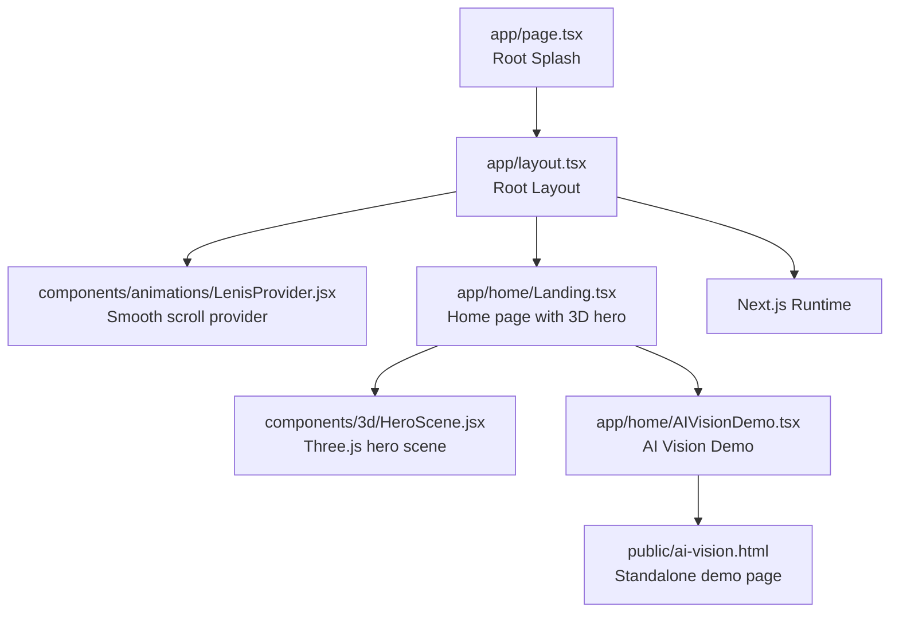
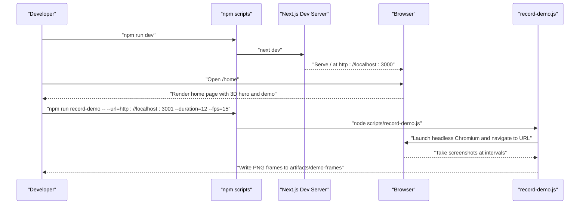
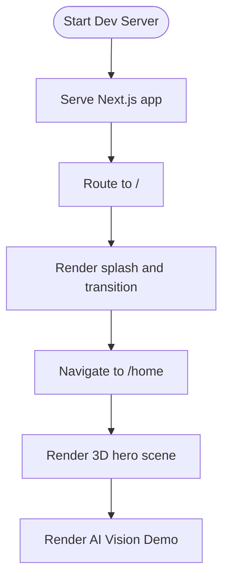
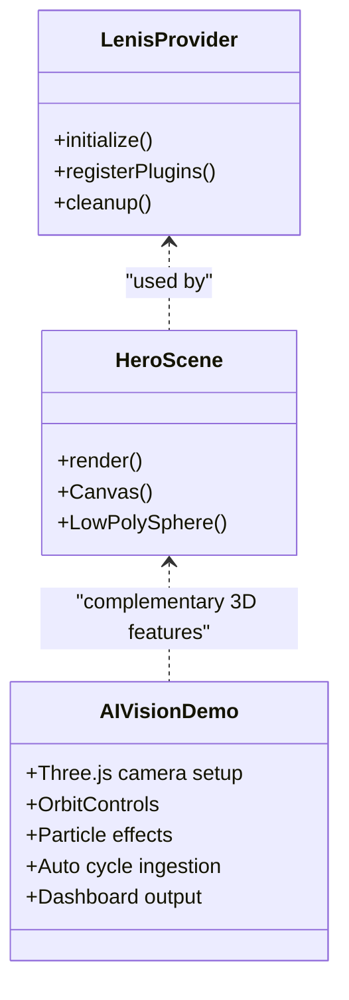
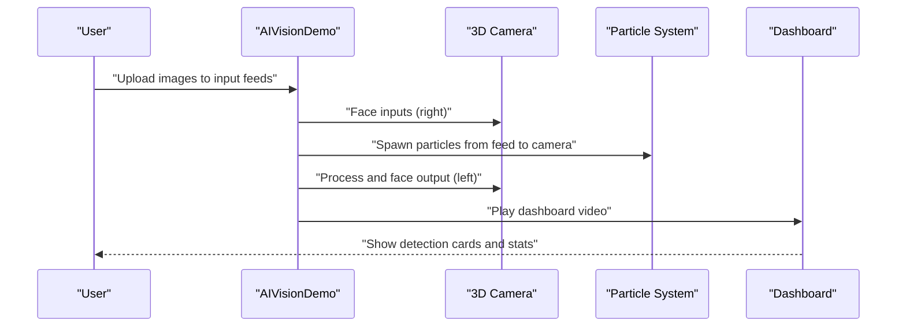
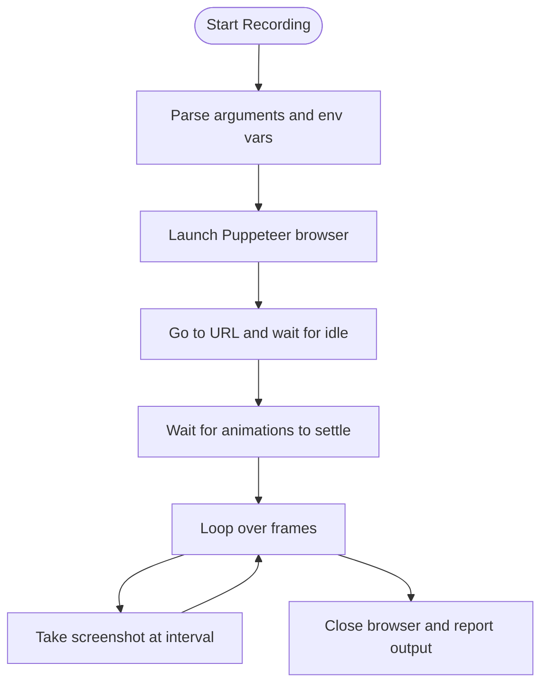
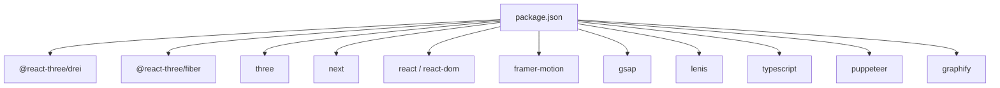

# Getting Started

<cite>
**Referenced Files in This Document**
- [package.json](file://package.json)
- [README.md](file://README.md)
- [scripts/README-record.md](file://scripts/README-record.md)
- [scripts/record-demo.js](file://scripts/record-demo.js)
- [app/page.tsx](file://app/page.tsx)
- [app/layout.tsx](file://app/layout.tsx)
- [app/home/Landing.tsx](file://app/home/Landing.tsx)
- [app/home/AIVisionDemo.tsx](file://app/home/AIVisionDemo.tsx)
- [components/3d/HeroScene.jsx](file://components/3d/HeroScene.jsx)
- [components/animations/LenisProvider.jsx](file://components/animations/LenisProvider.jsx)
- [public/ai-vision.html](file://public/ai-vision.html)
- [tsconfig.json](file://tsconfig.json)
</cite>

## Table of Contents
1. [Introduction](#introduction)
2. [Project Structure](#project-structure)
3. [Core Components](#core-components)
4. [Architecture Overview](#architecture-overview)
5. [Detailed Component Analysis](#detailed-component-analysis)
6. [Dependency Analysis](#dependency-analysis)
7. [Performance Considerations](#performance-considerations)
8. [Troubleshooting Guide](#troubleshooting-guide)
9. [Conclusion](#conclusion)
10. [Appendices](#appendices)

## Introduction
This guide helps you install, run, and explore the Zeex AI Main Website locally. It covers:
- Prerequisites and environment setup
- Installing dependencies and launching the development server
- Accessing the main landing page and navigating the 3D visualization features
- Interacting with the AI vision demonstration
- Recording a demo using the provided automation script
- Troubleshooting common issues and browser compatibility notes

## Project Structure
The project is a Next.js application with a modern client-side rendering stack, featuring:
- A splash and transition sequence leading to the home page
- A home page with animated 3D hero visuals and an interactive AI vision demo
- A dedicated AI vision demo page with a 3D camera model and animated pipeline visualization
- A development server script and a demo recording script

**Diagram sources**
- [app/page.tsx:1-55](file://app/page.tsx#L1-L55)
- [app/layout.tsx:1-24](file://app/layout.tsx#L1-L24)
- [components/animations/LenisProvider.jsx:1-52](file://components/animations/LenisProvider.jsx#L1-L52)
- [app/home/Landing.tsx:1-1158](file://app/home/Landing.tsx#L1-L1158)
- [components/3d/HeroScene.jsx:1-37](file://components/3d/HeroScene.jsx#L1-L37)
- [app/home/AIVisionDemo.tsx:1-562](file://app/home/AIVisionDemo.tsx#L1-L562)
- [public/ai-vision.html:1-616](file://public/ai-vision.html#L1-L616)

**Section sources**
- [app/page.tsx:1-55](file://app/page.tsx#L1-L55)
- [app/layout.tsx:1-24](file://app/layout.tsx#L1-L24)
- [app/home/Landing.tsx:1-1158](file://app/home/Landing.tsx#L1-L1158)
- [components/3d/HeroScene.jsx:1-37](file://components/3d/HeroScene.jsx#L1-L37)
- [app/home/AIVisionDemo.tsx:1-562](file://app/home/AIVisionDemo.tsx#L1-L562)
- [public/ai-vision.html:1-616](file://public/ai-vision.html#L1-L616)

## Core Components
- Development scripts and runtime
  - Dev server: starts the Next.js app in development mode
  - Build: compiles the application
  - Start: serves the production build
  - Record demo: automates capturing screenshots of the running site for video creation
- Home page and 3D hero
  - A splash and transition sequence leads to the home route
  - Smooth scrolling and animated 3D hero scene powered by Three.js and Framer Motion
- AI vision demo
  - Interactive 3D camera model with orbit controls
  - Automated ingestion pipeline visualization with particle effects and dashboard output
  - Standalone HTML page for the demo

**Section sources**
- [package.json:5-9](file://package.json#L5-L9)
- [app/page.tsx:9-54](file://app/page.tsx#L9-L54)
- [app/home/Landing.tsx:1-1158](file://app/home/Landing.tsx#L1-L1158)
- [app/home/AIVisionDemo.tsx:1-562](file://app/home/AIVisionDemo.tsx#L1-L562)
- [public/ai-vision.html:1-616](file://public/ai-vision.html#L1-L616)

## Architecture Overview
The application follows a client-side rendered Next.js architecture:
- Root layout initializes providers for smooth scrolling and global navigation
- The root page renders a splash and transitions to the home route
- The home page composes animated 3D visuals and the AI vision demo
- The demo recording script uses Puppeteer to capture frames from the dev server

**Diagram sources**
- [package.json:5-9](file://package.json#L5-L9)
- [scripts/README-record.md:15-25](file://scripts/README-record.md#L15-L25)
- [scripts/record-demo.js:5-45](file://scripts/record-demo.js#L5-L45)

**Section sources**
- [package.json:5-9](file://package.json#L5-L9)
- [scripts/README-record.md:15-25](file://scripts/README-record.md#L15-L25)
- [scripts/record-demo.js:5-45](file://scripts/record-demo.js#L5-L45)

## Detailed Component Analysis

### Installation and Local Setup
- Prerequisites
  - Node.js version aligned with the project’s runtime (Next.js 14)
  - A modern browser for 3D rendering (WebGL)
- Steps
  - Install dependencies: run the package manager install command
  - Start the development server: run the dev script
  - Open the browser to the home route to view the landing page and demos

**Section sources**
- [package.json:11-21](file://package.json#L11-L21)
- [package.json:5-9](file://package.json#L5-L9)
- [tsconfig.json:1-40](file://tsconfig.json#L1-L40)

### Development Server and Local Environment
- The dev server runs on the default Next.js port and serves the application
- The root page triggers a transition to the home route after a splash sequence
- The home page integrates smooth scrolling and animated 3D visuals

**Diagram sources**
- [app/page.tsx:9-54](file://app/page.tsx#L9-L54)
- [app/layout.tsx:13-21](file://app/layout.tsx#L13-L21)
- [app/home/Landing.tsx:1-1158](file://app/home/Landing.tsx#L1-L1158)
- [components/3d/HeroScene.jsx:23-36](file://components/3d/HeroScene.jsx#L23-L36)

**Section sources**
- [app/page.tsx:9-54](file://app/page.tsx#L9-L54)
- [app/layout.tsx:13-21](file://app/layout.tsx#L13-L21)
- [components/animations/LenisProvider.jsx:1-52](file://components/animations/LenisProvider.jsx#L1-L52)
- [components/3d/HeroScene.jsx:1-37](file://components/3d/HeroScene.jsx#L1-L37)

### Accessing the Main Landing Page
- After the splash completes, the application navigates to the home route
- The home page renders animated 3D visuals and interactive elements
- The AI vision demo is available on the home page and also as a standalone HTML page

**Section sources**
- [app/page.tsx:9-54](file://app/page.tsx#L9-L54)
- [app/home/Landing.tsx:1-1158](file://app/home/Landing.tsx#L1-L1158)
- [public/ai-vision.html:1-616](file://public/ai-vision.html#L1-L616)

### Navigating the 3D Visualization Features
- Smooth scrolling and parallax effects are enabled via a provider
- The hero scene uses Three.js with orbit controls and floating geometry
- The AI vision demo includes:
  - A 3D camera model with orbit controls
  - Animated scanning beams and particle effects
  - An automated ingestion pipeline visualization
  - A dashboard panel with detection output and statistics

**Diagram sources**
- [components/animations/LenisProvider.jsx:1-52](file://components/animations/LenisProvider.jsx#L1-L52)
- [components/3d/HeroScene.jsx:1-37](file://components/3d/HeroScene.jsx#L1-L37)
- [app/home/AIVisionDemo.tsx:1-562](file://app/home/AIVisionDemo.tsx#L1-L562)

**Section sources**
- [components/animations/LenisProvider.jsx:1-52](file://components/animations/LenisProvider.jsx#L1-L52)
- [components/3d/HeroScene.jsx:1-37](file://components/3d/HeroScene.jsx#L1-L37)
- [app/home/AIVisionDemo.tsx:1-562](file://app/home/AIVisionDemo.tsx#L1-L562)

### Interacting with the AI Vision Demonstration
- The demo supports:
  - Manual camera rotation via orbit controls
  - Uploading images to input feeds
  - Automatic ingestion and visualization of detection results
  - Playback of a dashboard video during output stage
- The standalone HTML page provides a self-contained demo experience

**Diagram sources**
- [app/home/AIVisionDemo.tsx:256-437](file://app/home/AIVisionDemo.tsx#L256-L437)
- [public/ai-vision.html:371-612](file://public/ai-vision.html#L371-L612)

**Section sources**
- [app/home/AIVisionDemo.tsx:256-437](file://app/home/AIVisionDemo.tsx#L256-L437)
- [public/ai-vision.html:371-612](file://public/ai-vision.html#L371-L612)

### Recording a Demo
- The demo recording workflow uses a Puppeteer script to:
  - Launch a headless browser
  - Navigate to the running site
  - Take periodic screenshots at a specified frame rate
  - Write frames to a directory for later video encoding
- The script accepts parameters for URL, duration, FPS, and output directory

**Diagram sources**
- [scripts/record-demo.js:5-45](file://scripts/record-demo.js#L5-L45)

**Section sources**
- [scripts/README-record.md:15-39](file://scripts/README-record.md#L15-L39)
- [scripts/record-demo.js:5-45](file://scripts/record-demo.js#L5-L45)

## Dependency Analysis
- Runtime dependencies include Next.js, React, Three.js, and related 3D libraries
- Development dependencies include TypeScript, Puppeteer, and graph utilities
- The project uses a strict TypeScript configuration suitable for Next.js

**Diagram sources**
- [package.json:11-29](file://package.json#L11-L29)

**Section sources**
- [package.json:11-29](file://package.json#L11-L29)
- [tsconfig.json:1-40](file://tsconfig.json#L1-L40)

## Performance Considerations
- Keep animations and particle effects optimized for the target device
- Use the provided smooth scrolling provider to reduce jank on scroll-heavy pages
- For the demo recording, adjust FPS and duration to balance quality and file size

## Troubleshooting Guide
- Permission errors on Windows
  - Run the package manager install command with elevated privileges if needed
- Puppeteer and Chromium
  - The script launches a compatible Chromium automatically; set an executable path if you prefer a system Chrome
- Port conflicts
  - The recording script defaults to a specific port; ensure it is free or change the port accordingly
- WebGL rendering issues
  - Ensure your browser supports WebGL and that hardware acceleration is enabled

**Section sources**
- [scripts/README-record.md:37-39](file://scripts/README-record.md#L37-L39)
- [README.md:82-144](file://README.md#L82-L144)

## Conclusion
You are now ready to run the Zeex AI Main Website locally, explore the animated 3D hero and AI vision demo, and record a presentation-ready video. For deeper context on the project’s methodology and commands, refer to the project’s documentation.

## Appendices
- Additional resources and commands are documented in the project’s main readme

**Section sources**
- [README.md:274-337](file://README.md#L274-L337)