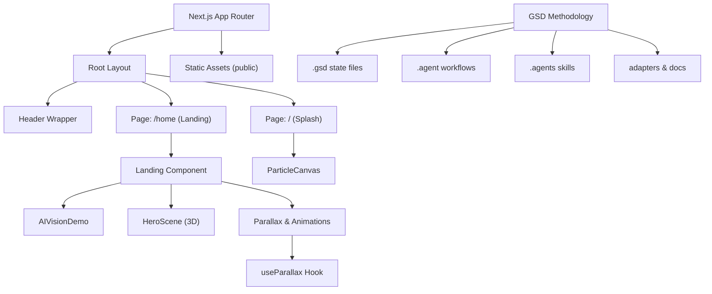
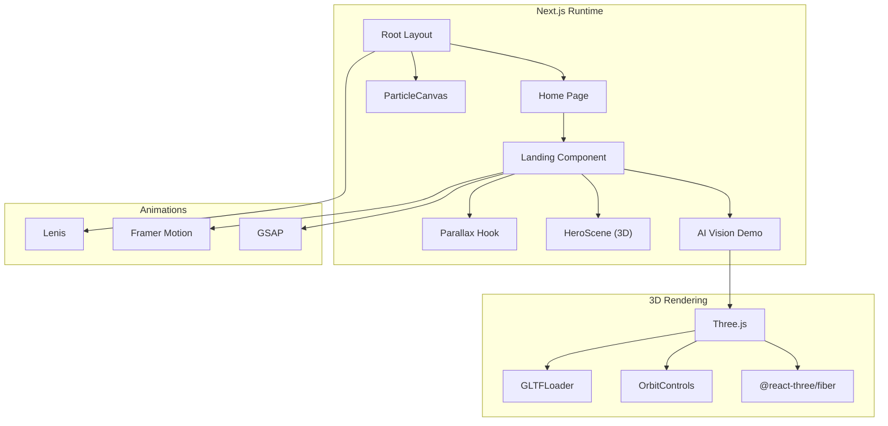
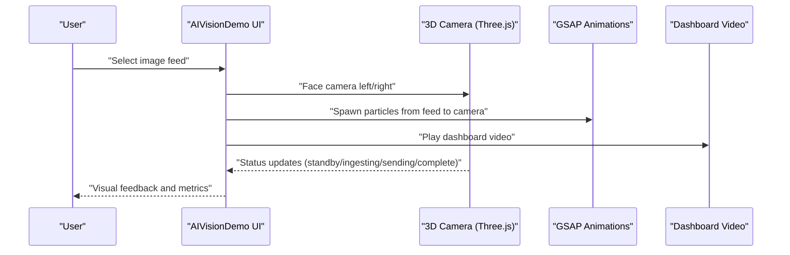
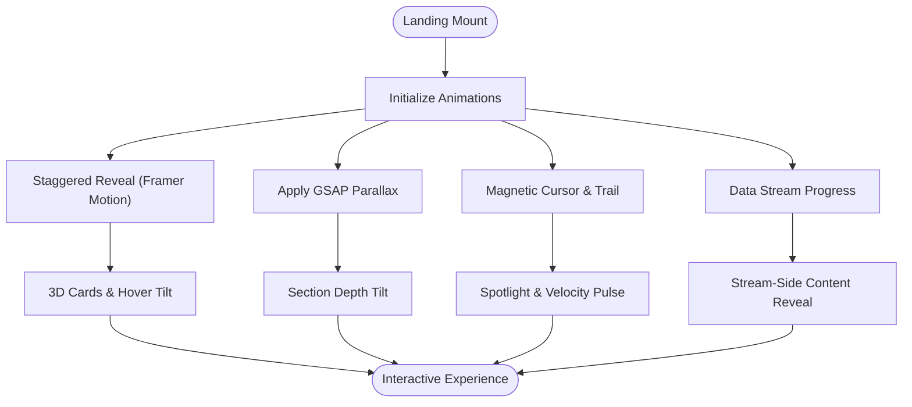
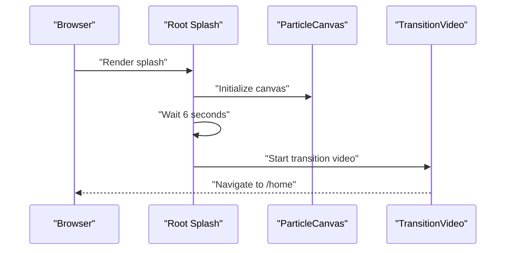
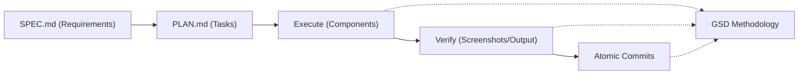
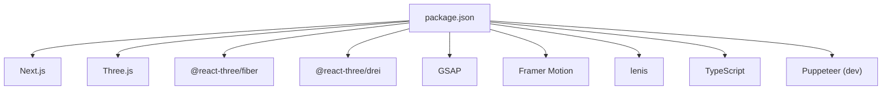

# Project Overview

<cite>
**Referenced Files in This Document**
- [README.md](file://README.md)
- [package.json](file://package.json)
- [app/layout.tsx](file://app/layout.tsx)
- [app/page.tsx](file://app/page.tsx)
- [app/home/page.tsx](file://app/home/page.tsx)
- [app/home/Landing.tsx](file://app/home/Landing.tsx)
- [app/home/AIVisionDemo.tsx](file://app/home/AIVisionDemo.tsx)
- [components/3d/HeroScene.jsx](file://components/3d/HeroScene.jsx)
- [app/components/ParticleCanvas.tsx](file://app/components/ParticleCanvas.tsx)
- [app/components/HeaderWrapper.tsx](file://app/components/HeaderWrapper.tsx)
- [components/animations/useParallax.js](file://components/animations/useParallax.js)
- [GSD-STYLE.md](file://GSD-STYLE.md)
- [PROJECT_RULES.md](file://PROJECT_RULES.md)
- [app/about/page.tsx](file://app/about/page.tsx)
- [app/services/page.tsx](file://app/services/page.tsx)
</cite>

## Table of Contents
1. [Introduction](#introduction)
2. [Project Structure](#project-structure)
3. [Core Components](#core-components)
4. [Architecture Overview](#architecture-overview)
5. [Detailed Component Analysis](#detailed-component-analysis)
6. [Dependency Analysis](#dependency-analysis)
7. [Performance Considerations](#performance-considerations)
8. [Troubleshooting Guide](#troubleshooting-guide)
9. [Conclusion](#conclusion)

## Introduction
Zeex AI’s Main Website is a Next.js 14 showcase site that demonstrates the company’s AI-powered surveillance and security platform. Its primary goal is to present a compelling, immersive experience that communicates the reliability and capabilities of Zeex AI’s security solutions. The site emphasizes “Stop vibecoding. Start shipping.” — a core philosophy that aligns with the GSD methodology. GSD transforms AI-assisted development into consistent, verifiable outcomes by enforcing rigorous planning, execution, verification, and atomic commits. This project serves as both a marketing and technical demonstration: a high-performance, visually rich frontend that showcases Zeex AI’s AI vision demo and 3D camera visualization, while embodying the disciplined, repeatable workflow that powers the underlying GSD system.

- The project’s mission is to communicate:
  - Reliability: AI code generation becomes dependable through structured workflows.
  - Consistency: Verified outcomes replace guesswork.
  - Clarity: Visitors can quickly understand Zeex AI’s security platform and its practical applications.

- Target audience:
  - Solo developers who want consistent AI-assisted results.
  - Small teams seeking structure without enterprise overhead.
  - Anyone tired of inconsistent AI-generated code.

**Section sources**
- [README.md:17-19](file://README.md#L17-L19)
- [README.md:72-79](file://README.md#L72-L79)

## Project Structure
The project follows a Next.js 14 app directory structure with a focus on performance, interactivity, and advanced 3D graphics. Key areas:
- app/: Application routes, pages, and shared UI components.
- components/: Reusable UI and 3D/animation helpers.
- public/assets/: Static assets, including 3D models and videos.
- scripts/: Automation and validation utilities.
- GSD-related directories (.agent, .agents, .gemini, .gsd, adapters, docs): Methodology and workflow scaffolding for the GSD system.

**Diagram sources**
- [app/layout.tsx:13-23](file://app/layout.tsx#L13-L23)
- [app/page.tsx:9-54](file://app/page.tsx#L9-L54)
- [app/home/page.tsx:7-13](file://app/home/page.tsx#L7-L13)
- [app/home/Landing.tsx:60-800](file://app/home/Landing.tsx#L60-L800)
- [app/home/AIVisionDemo.tsx:11-562](file://app/home/AIVisionDemo.tsx#L11-L562)
- [components/3d/HeroScene.jsx:23-37](file://components/3d/HeroScene.jsx#L23-L37)
- [app/components/ParticleCanvas.tsx:5-71](file://app/components/ParticleCanvas.tsx#L5-L71)
- [components/animations/useParallax.js:1-31](file://components/animations/useParallax.js#L1-L31)
- [README.md:476-518](file://README.md#L476-L518)

**Section sources**
- [README.md:476-518](file://README.md#L476-L518)
- [package.json:1-31](file://package.json#L1-L31)

## Core Components
- Root layout and navigation:
  - Root layout initializes global styles and wraps pages with a header and a scroll provider for smooth navigation.
  - Header wrapper conditionally hides the header on the splash page to maximize impact.

- Splash and transition:
  - The root page renders animated particle effects, scan lines, HUD elements, and transitions to the home route after a timed sequence.

- Home landing:
  - The landing page integrates advanced scroll-driven animations, 3D scenes, interactive cards, and a data-stream progress indicator.
  - It leverages GSAP for parallax, Framer Motion for staggered reveals, and React Three Fiber for 3D visuals.

- AI Vision Demo:
  - An interactive 3D camera visualization powered by Three.js and OrbitControls.
  - Features a GLTF model of a CCTV camera, animated rotations, and a data ingestion pipeline with particle effects and dashboard video playback.

- 3D Hero Scene:
  - A lightweight, suspense-enabled 3D scene using @react-three/fiber and @react-three/drei for a floating, distorted sphere with orbit controls disabled.

- Animation utilities:
  - A GSAP-based parallax hook for scroll-triggered motion.
  - A particle canvas for background animation.

- GSD methodology integration:
  - The project’s structure and conventions mirror GSD’s meta-prompting approach, with clearly defined roles for workflows, skills, templates, and state persistence.

**Section sources**
- [app/layout.tsx:13-23](file://app/layout.tsx#L13-L23)
- [app/components/HeaderWrapper.tsx:7-24](file://app/components/HeaderWrapper.tsx#L7-L24)
- [app/page.tsx:9-54](file://app/page.tsx#L9-L54)
- [app/home/page.tsx:7-13](file://app/home/page.tsx#L7-L13)
- [app/home/Landing.tsx:60-800](file://app/home/Landing.tsx#L60-L800)
- [app/home/AIVisionDemo.tsx:11-562](file://app/home/AIVisionDemo.tsx#L11-L562)
- [components/3d/HeroScene.jsx:23-37](file://components/3d/HeroScene.jsx#L23-L37)
- [app/components/ParticleCanvas.tsx:5-71](file://app/components/ParticleCanvas.tsx#L5-L71)
- [components/animations/useParallax.js:1-31](file://components/animations/useParallax.js#L1-L31)
- [GSD-STYLE.md:17-41](file://GSD-STYLE.md#L17-L41)
- [PROJECT_RULES.md:9-21](file://PROJECT_RULES.md#L9-L21)

## Architecture Overview
The frontend architecture blends Next.js app routing, client-side interactivity, and advanced 3D rendering:
- Routing and hydration:
  - The root layout sets metadata and injects providers for scroll behavior and header management.
  - Pages are client-rendered to enable rich animations and 3D interactions.

- Animation and motion:
  - GSAP for parallax and smooth transitions.
  - Framer Motion for staggered reveals and micro-interactions.
  - Lenis for smooth scroll behavior.

- 3D visualization:
  - Three.js for WebGL rendering and OrbitControls for camera manipulation.
  - React Three Fiber for declarative scene construction.
  - GLTFLoader for realistic camera model loading with fallbacks.

- Asset pipeline:
  - Static assets are served from public, including 3D models and videos for the AI vision demo.

- GSD workflow alignment:
  - The project mirrors GSD’s emphasis on planning, verification, and atomic commits, reflected in the modular, testable components and clear separation of concerns.

**Diagram sources**
- [app/layout.tsx:13-23](file://app/layout.tsx#L13-L23)
- [app/home/page.tsx:7-13](file://app/home/page.tsx#L7-L13)
- [app/home/Landing.tsx:60-800](file://app/home/Landing.tsx#L60-L800)
- [app/home/AIVisionDemo.tsx:11-562](file://app/home/AIVisionDemo.tsx#L11-L562)
- [components/3d/HeroScene.jsx:23-37](file://components/3d/HeroScene.jsx#L23-L37)
- [app/components/ParticleCanvas.tsx:5-71](file://app/components/ParticleCanvas.tsx#L5-L71)
- [components/animations/useParallax.js:1-31](file://components/animations/useParallax.js#L1-L31)

## Detailed Component Analysis

### AI Vision Demo: Interactive 3D Camera Visualization
The AI Vision Demo is the centerpiece for showcasing Zeex AI’s platform. It simulates an AI-powered surveillance pipeline with:
- A 3D camera model (procedural or GLTF) with animated orientation.
- Input feeds (images) that visually “ingest” into the camera and render to a dashboard video.
- Particle effects to represent data flow.
- Real-time status indicators and LED feedback.

**Diagram sources**
- [app/home/AIVisionDemo.tsx:11-562](file://app/home/AIVisionDemo.tsx#L11-L562)

**Section sources**
- [app/home/AIVisionDemo.tsx:11-562](file://app/home/AIVisionDemo.tsx#L11-L562)

### Landing Page: Scroll-Driven Experience with 3D and Motion
The landing page orchestrates multiple animation layers:
- Scroll-driven parallax via GSAP.
- Staggered card reveals with Framer Motion.
- 3D hero scene and floating elements.
- Data stream progress and magnetic cursor effects.

**Diagram sources**
- [app/home/Landing.tsx:60-800](file://app/home/Landing.tsx#L60-L800)
- [components/animations/useParallax.js:1-31](file://components/animations/useParallax.js#L1-L31)

**Section sources**
- [app/home/Landing.tsx:60-800](file://app/home/Landing.tsx#L60-L800)
- [components/animations/useParallax.js:1-31](file://components/animations/useParallax.js#L1-L31)

### Splash and Transition: Immersive Entry
The splash page establishes brand presence with:
- Particle background canvas.
- Scan lines and HUD elements.
- Timed transition to the home route.

**Diagram sources**
- [app/page.tsx:9-54](file://app/page.tsx#L9-L54)
- [app/components/ParticleCanvas.tsx:5-71](file://app/components/ParticleCanvas.tsx#L5-L71)

**Section sources**
- [app/page.tsx:9-54](file://app/page.tsx#L9-L54)
- [app/components/ParticleCanvas.tsx:5-71](file://app/components/ParticleCanvas.tsx#L5-L71)

### Relationship Between Frontend Showcase and GSD Workflow
While the website is a frontend showcase, it embodies the GSD methodology in structure and process:
- Planning and specification:
  - The project’s conventions mirror GSD’s emphasis on clear plans and state preservation.
- Execution and verification:
  - Components are modular and testable, reflecting GSD’s atomic task execution and verification requirements.
- Consistency and reliability:
  - The disciplined use of providers, hooks, and 3D rendering ensures predictable behavior across devices.

**Diagram sources**
- [PROJECT_RULES.md:9-21](file://PROJECT_RULES.md#L9-L21)
- [GSD-STYLE.md:265-273](file://GSD-STYLE.md#L265-L273)

**Section sources**
- [PROJECT_RULES.md:9-21](file://PROJECT_RULES.md#L9-L21)
- [GSD-STYLE.md:265-273](file://GSD-STYLE.md#L265-L273)

## Dependency Analysis
External libraries and their roles:
- Next.js 14: App router, SSR/SSG, and dynamic imports for performance.
- Three.js and @react-three/fiber: 3D rendering and declarative scene composition.
- @react-three/drei: Helpers for materials, controls, and primitives.
- GSAP: Scroll-driven animations and micro-interactions.
- Framer Motion: Staggered reveals and motion orchestration.
- lenis: Smooth scroll behavior.
- TypeScript and Puppeteer (dev): Type safety and automated validation.

**Diagram sources**
- [package.json:11-21](file://package.json#L11-L21)

**Section sources**
- [package.json:11-21](file://package.json#L11-L21)

## Performance Considerations
- Client-side rendering and lazy loading:
  - Dynamic imports for heavy 3D and animation providers minimize initial bundle size.
- 3D optimization:
  - Pixel ratio adjustments, controlled damping, and fallbacks ensure smooth performance across devices.
- Animation efficiency:
  - GSAP and requestAnimationFrame are used judiciously; parallax and scroll-driven effects are throttled.
- Asset delivery:
  - Static assets are served from public; consider compression and caching strategies for videos and 3D models.
- GSD-aligned efficiency:
  - The project’s structure supports incremental development and verification, reducing wasted cycles.

[No sources needed since this section provides general guidance]

## Troubleshooting Guide
Common issues and resolutions:
- 3D model not loading:
  - The demo gracefully falls back to a procedural camera model if GLTF fails. Verify asset paths and network availability.
- Animation glitches on low-end devices:
  - Reduce pixel ratio or disable certain effects; ensure devicePixelRatio thresholds are respected.
- Scroll jank:
  - Confirm lenis and GSAP ScrollTrigger are initialized correctly; avoid conflicting scroll handlers.
- Header visibility on splash:
  - The header wrapper hides the header on the root path; ensure routing navigates correctly to the home route after splash.

**Section sources**
- [app/home/AIVisionDemo.tsx:104-137](file://app/home/AIVisionDemo.tsx#L104-L137)
- [app/components/HeaderWrapper.tsx:7-24](file://app/components/HeaderWrapper.tsx#L7-L24)

## Conclusion
Zeex AI’s Main Website is a polished, performance-conscious showcase that communicates the reliability and power of Zeex AI’s security platform. Through advanced 3D graphics, interactive demonstrations, and scroll-driven animations, it immerses visitors in a vision of AI-assisted security. The project’s architecture and conventions align with the GSD methodology, emphasizing planning, verification, and consistent outcomes. For developers, the site offers a practical blueprint for combining modern frontend technologies with disciplined workflows, while for visitors, it delivers a compelling narrative of how Zeex AI transforms surveillance into intelligent, proactive protection.

[No sources needed since this section summarizes without analyzing specific files]