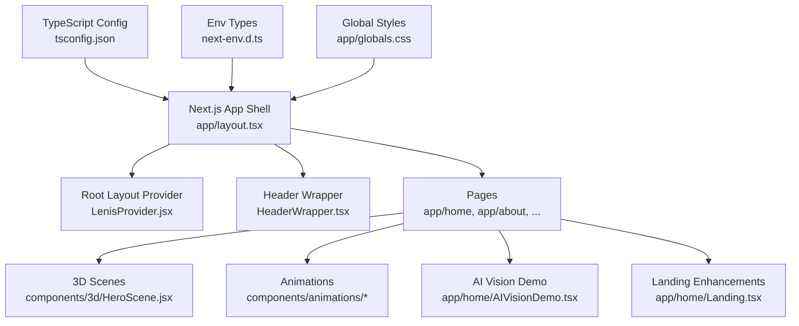
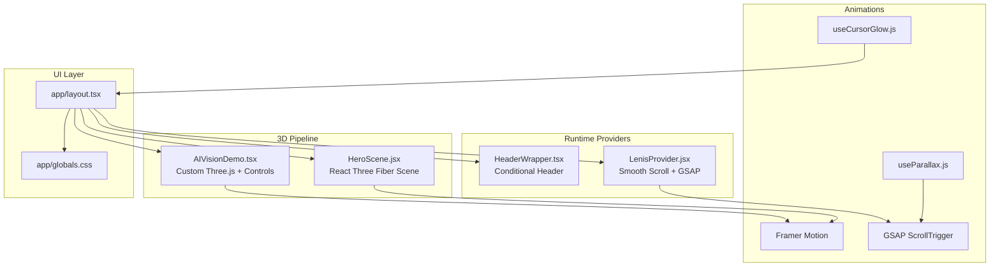
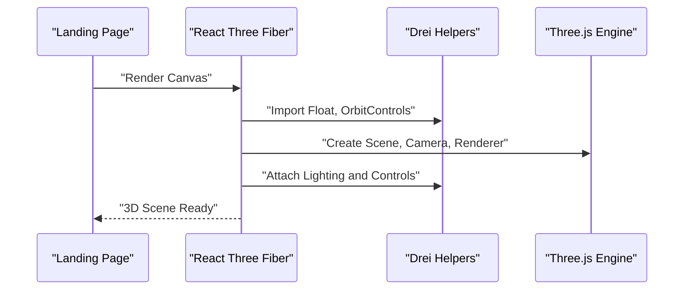
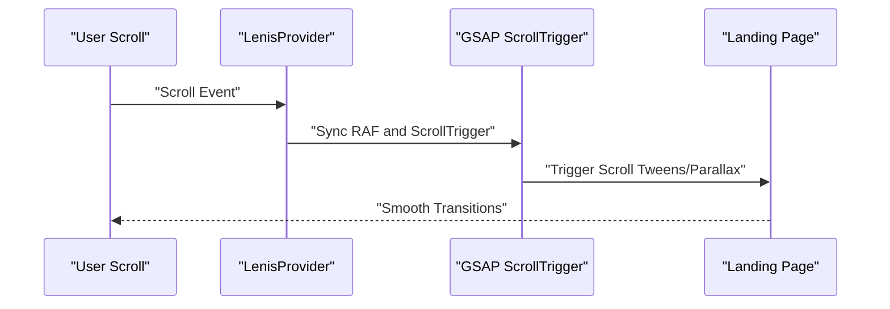
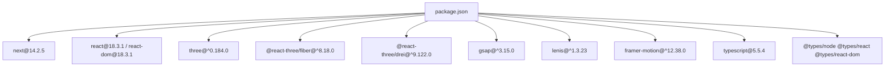

# Technology Stack & Dependencies

<cite>
**Referenced Files in This Document**
- [package.json](file://package.json)
- [tsconfig.json](file://tsconfig.json)
- [next-env.d.ts](file://next-env.d.ts)
- [app/layout.tsx](file://app/layout.tsx)
- [app/globals.css](file://app/globals.css)
- [app/components/HeaderWrapper.tsx](file://app/components/HeaderWrapper.tsx)
- [components/3d/HeroScene.jsx](file://components/3d/HeroScene.jsx)
- [components/animations/LenisProvider.jsx](file://components/animations/LenisProvider.jsx)
- [components/animations/useCursorGlow.js](file://components/animations/useCursorGlow.js)
- [components/animations/useParallax.js](file://components/animations/useParallax.js)
- [app/home/AIVisionDemo.tsx](file://app/home/AIVisionDemo.tsx)
- [app/home/Landing.tsx](file://app/home/Landing.tsx)
</cite>

## Table of Contents
1. [Introduction](#introduction)
2. [Project Structure](#project-structure)
3. [Core Components](#core-components)
4. [Architecture Overview](#architecture-overview)
5. [Detailed Component Analysis](#detailed-component-analysis)
6. [Dependency Analysis](#dependency-analysis)
7. [Performance Considerations](#performance-considerations)
8. [Troubleshooting Guide](#troubleshooting-guide)
9. [Conclusion](#conclusion)

## Introduction
This document describes the technology stack and dependencies powering the Zeex AI Main Website. The site is built on Next.js 14 with React 18, leveraging TypeScript for type safety and developer productivity. It integrates a modern 3D graphics pipeline using React Three Fiber and Three.js for real-time 3D rendering, complemented by GSAP for advanced scroll-driven animations, Lenis for smooth scrolling, and Framer Motion for UI transitions. The build system is configured with Next.js’s compiler and TypeScript strict mode, ensuring optimal performance and maintainability.

## Project Structure
The project follows Next.js App Router conventions with a clear separation of concerns:
- app/: Application shell, routing, and page components
- components/: Shared UI and animation helpers
- public/: Static assets and demos
- node_modules/: Installed dependencies
- Configuration files for TypeScript, Next.js, and environment types

**Diagram sources**
- [app/layout.tsx:1-24](file://app/layout.tsx#L1-L24)
- [components/animations/LenisProvider.jsx:1-52](file://components/animations/LenisProvider.jsx#L1-L52)
- [app/components/HeaderWrapper.tsx:1-25](file://app/components/HeaderWrapper.tsx#L1-L25)
- [components/3d/HeroScene.jsx:1-37](file://components/3d/HeroScene.jsx#L1-L37)
- [components/animations/useParallax.js:1-31](file://components/animations/useParallax.js#L1-L31)
- [app/home/AIVisionDemo.tsx:1-562](file://app/home/AIVisionDemo.tsx#L1-L562)
- [app/home/Landing.tsx:1-800](file://app/home/Landing.tsx#L1-L800)
- [tsconfig.json:1-40](file://tsconfig.json#L1-L40)
- [next-env.d.ts:1-6](file://next-env.d.ts#L1-L6)
- [app/globals.css:1-800](file://app/globals.css#L1-L800)

**Section sources**
- [app/layout.tsx:1-24](file://app/layout.tsx#L1-L24)
- [tsconfig.json:1-40](file://tsconfig.json#L1-L40)
- [next-env.d.ts:1-6](file://next-env.d.ts#L1-L6)
- [app/globals.css:1-800](file://app/globals.css#L1-L800)

## Core Components
- Next.js 14: Provides server-side rendering, static generation, ISR, and modern React patterns. The root layout initializes providers and global styles.
- TypeScript: Enforced strict typing and incremental compilation for reliability.
- React 18: Concurrent features and automatic batching improve interactivity.
- 3D Graphics: React Three Fiber for declarative 3D scenes, Three.js for the WebGL engine, and Drei for helpful helpers.
- Animation Ecosystem: GSAP for scroll-driven animations and tweens, Lenis for smooth scroll behavior, Framer Motion for UI transitions and micro-interactions.
- Global Styling: Tailored CSS for 3D overlays, cursor effects, and animated brand elements.

**Section sources**
- [package.json:11-29](file://package.json#L11-L29)
- [tsconfig.json:1-40](file://tsconfig.json#L1-L40)
- [app/layout.tsx:1-24](file://app/layout.tsx#L1-L24)
- [app/globals.css:1-800](file://app/globals.css#L1-L800)

## Architecture Overview
The runtime architecture centers on Next.js App Router with client-side providers and page-level enhancements:
- Root layout mounts LenisProvider for scroll orchestration and HeaderWrapper for navigation.
- Page components import 3D scenes and animation helpers dynamically to optimize SSR and bundle sizes.
- Global CSS defines 3D overlays, cursor effects, and brand animations.

**Diagram sources**
- [app/layout.tsx:1-24](file://app/layout.tsx#L1-L24)
- [components/animations/LenisProvider.jsx:1-52](file://components/animations/LenisProvider.jsx#L1-L52)
- [app/components/HeaderWrapper.tsx:1-25](file://app/components/HeaderWrapper.tsx#L1-L25)
- [components/3d/HeroScene.jsx:1-37](file://components/3d/HeroScene.jsx#L1-L37)
- [app/home/AIVisionDemo.tsx:1-562](file://app/home/AIVisionDemo.tsx#L1-L562)
- [components/animations/useParallax.js:1-31](file://components/animations/useParallax.js#L1-L31)
- [components/animations/useCursorGlow.js:1-26](file://components/animations/useCursorGlow.js#L1-L26)
- [app/globals.css:1-800](file://app/globals.css#L1-L800)

## Detailed Component Analysis

### Next.js 14 and React 18
- Server-side rendering and static generation are enabled by default in Next.js 14. The root layout initializes providers and global styles.
- Strict TypeScript configuration enforces type safety and improves DX.
- Client directives are used to defer heavy client-side code to the browser.

Key behaviors:
- Dynamic imports for providers and 3D scenes reduce SSR payload.
- Environment types integrate seamlessly with Next.js.

**Section sources**
- [app/layout.tsx:1-24](file://app/layout.tsx#L1-L24)
- [next-env.d.ts:1-6](file://next-env.d.ts#L1-L6)
- [tsconfig.json:1-40](file://tsconfig.json#L1-L40)

### TypeScript Integration
- Strict compiler options, isolated modules, and incremental builds ensure fast rebuilds and fewer runtime errors.
- Plugin integration for Next.js enables type-aware JSX transforms.

Benefits:
- Enhanced developer experience with autocompletion and refactoring.
- Reduced regressions through compile-time checks.

**Section sources**
- [tsconfig.json:1-40](file://tsconfig.json#L1-L40)
- [next-env.d.ts:1-6](file://next-env.d.ts#L1-L6)

### 3D Graphics Stack: React Three Fiber + Three.js
React Three Fiber provides a declarative interface to Three.js, enabling real-time 3D rendering with React patterns. Drei offers convenient helpers for materials, lighting, and controls.

Implementation highlights:
- Canvas configuration sets device pixel ratio and camera parameters for crisp visuals.
- Suspense boundaries defer expensive scene initialization.
- OrbitControls and floating primitives create immersive, interactive experiences.
- A custom AI Vision demo composes Three.js directly for advanced camera and material setups.

**Diagram sources**
- [components/3d/HeroScene.jsx:1-37](file://components/3d/HeroScene.jsx#L1-L37)
- [app/home/Landing.tsx:1-800](file://app/home/Landing.tsx#L1-L800)

**Section sources**
- [components/3d/HeroScene.jsx:1-37](file://components/3d/HeroScene.jsx#L1-L37)
- [app/home/AIVisionDemo.tsx:1-562](file://app/home/AIVisionDemo.tsx#L1-L562)

### Animation Ecosystem: GSAP, Lenis, Framer Motion
- Lenis orchestrates smooth scroll behavior and integrates with GSAP ScrollTrigger for scroll-driven animations.
- GSAP powers tweens, ScrollTrigger-based parallax, and UI micro-interactions.
- Framer Motion provides declarative UI transitions and staggered reveals.

**Diagram sources**
- [components/animations/LenisProvider.jsx:1-52](file://components/animations/LenisProvider.jsx#L1-L52)
- [components/animations/useParallax.js:1-31](file://components/animations/useParallax.js#L1-L31)
- [app/home/Landing.tsx:1-800](file://app/home/Landing.tsx#L1-L800)

**Section sources**
- [components/animations/LenisProvider.jsx:1-52](file://components/animations/LenisProvider.jsx#L1-L52)
- [components/animations/useParallax.js:1-31](file://components/animations/useParallax.js#L1-L31)
- [app/home/Landing.tsx:1-800](file://app/home/Landing.tsx#L1-L800)

### Global Styling and Visual Effects
- Global CSS defines 3D overlay containers, cursor glow effects, and brand animations.
- Mix-blend-mode and transform optimizations enhance 3D scene integration.
- Animations leverage keyframes and CSS variables for performance.

**Section sources**
- [app/globals.css:1-800](file://app/globals.css#L1-L800)

## Dependency Analysis
Direct runtime dependencies include Next.js, React, Three.js, React Three Fiber, Drei, GSAP, Lenis, and Framer Motion. TypeScript and related type packages support the development experience.

**Diagram sources**
- [package.json:11-29](file://package.json#L11-L29)

**Section sources**
- [package.json:1-31](file://package.json#L1-L31)

## Performance Considerations
- Client-side only rendering: Dynamic imports for providers and 3D scenes minimize SSR cost.
- Device pixel ratio control: Canvas DPR tuning balances quality and performance.
- Suspense boundaries: Defer heavy scene initialization until hydration.
- Scroll-triggered animations: GSAP with ScrollTrigger ensures efficient updates.
- CSS blend modes and transforms: Prefer GPU-accelerated properties for 3D overlays.
- Incremental TypeScript builds: Faster rebuilds during development.

[No sources needed since this section provides general guidance]

## Troubleshooting Guide
Common issues and resolutions:
- 3D scene not rendering: Verify Canvas props and Suspense fallbacks. Confirm device pixel ratio and camera positioning.
- Scroll jank: Ensure Lenis RAF integration and ScrollTrigger registration. Check for conflicting scroll libraries.
- Animation lag: Reduce GSAP plugin usage, throttle scroll events, and prefer transform/opacity for GPU acceleration.
- Type errors: Align TypeScript strictness with Next.js plugin and ensure env types are included.

**Section sources**
- [components/3d/HeroScene.jsx:1-37](file://components/3d/HeroScene.jsx#L1-L37)
- [components/animations/LenisProvider.jsx:1-52](file://components/animations/LenisProvider.jsx#L1-L52)
- [app/home/Landing.tsx:1-800](file://app/home/Landing.tsx#L1-L800)
- [tsconfig.json:1-40](file://tsconfig.json#L1-L40)

## Conclusion
The Zeex AI Main Website combines Next.js 14, React 18, and TypeScript to deliver a modern, type-safe React application. The 3D pipeline leverages React Three Fiber and Three.js for immersive experiences, while GSAP, Lenis, and Framer Motion provide smooth, performant animations. The build system and configuration emphasize developer productivity and runtime performance. Maintaining version alignment among core dependencies and keeping Next.js and TypeScript updated will ensure continued compatibility and stability.