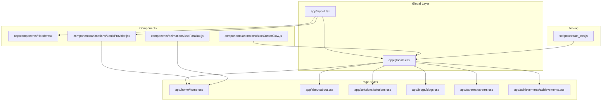
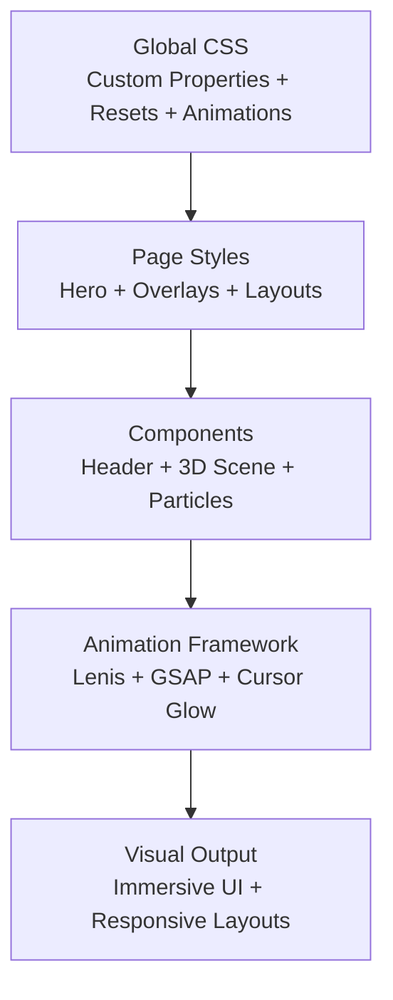
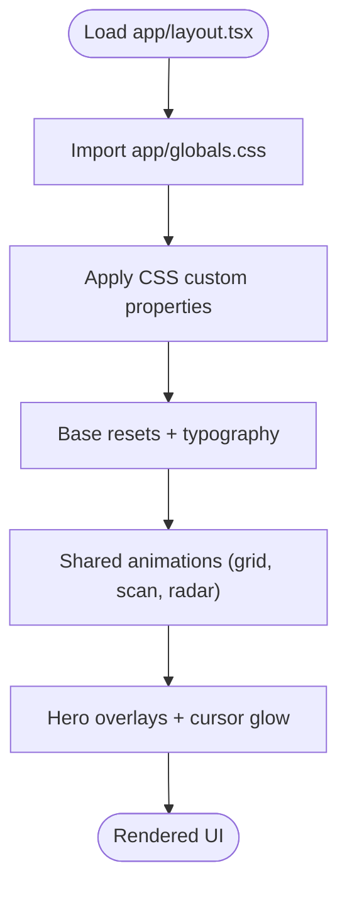
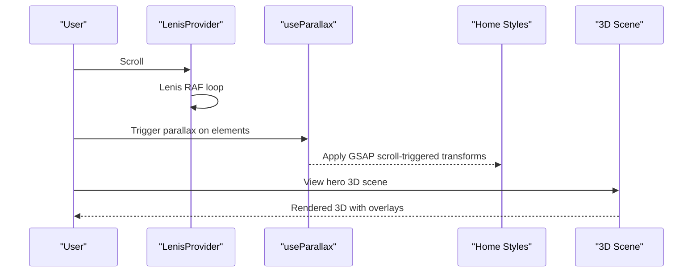
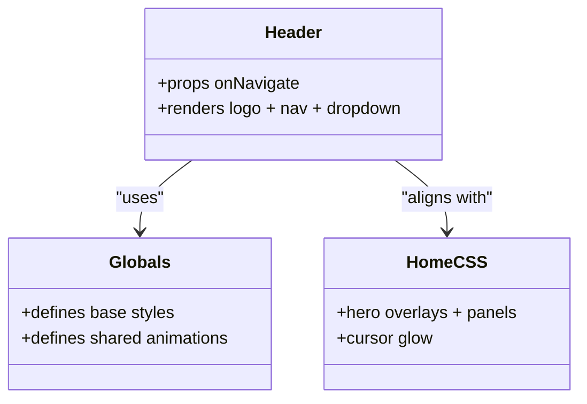
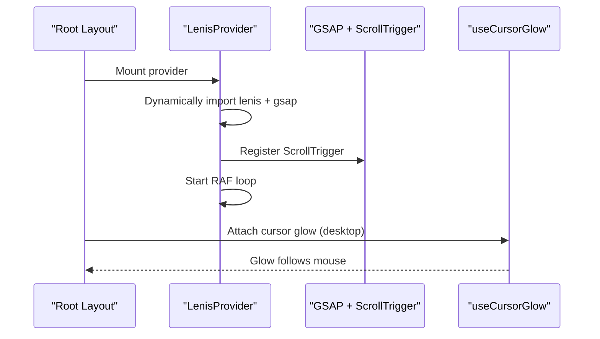
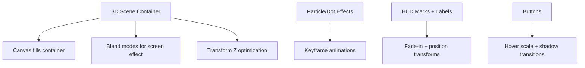
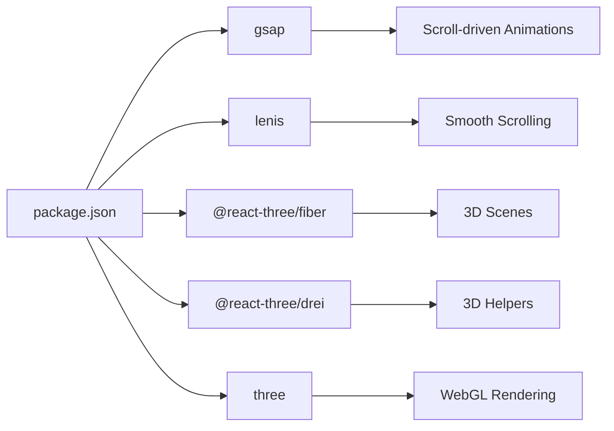

# Styling & Design System

<cite>
**Referenced Files in This Document**
- [app/layout.tsx](file://app/layout.tsx)
- [app/globals.css](file://app/globals.css)
- [app/home/home.css](file://app/home/home.css)
- [app/components/Header.tsx](file://app/components/Header.tsx)
- [components/animations/LenisProvider.jsx](file://components/animations/LenisProvider.jsx)
- [components/animations/useCursorGlow.js](file://components/animations/useCursorGlow.js)
- [components/animations/useParallax.js](file://components/animations/useParallax.js)
- [scripts/extract_css.js](file://scripts/extract_css.js)
- [app/about/about.css](file://app/about/about.css)
- [app/solutions/solutions.css](file://app/solutions/solutions.css)
- [app/blogs/blogs.css](file://app/blogs/blogs.css)
- [app/careers/careers.css](file://app/careers/careers.css)
- [app/achievements/achievements.css](file://app/achievements/achievements.css)
- [package.json](file://package.json)
</cite>

## Table of Contents
1. [Introduction](#introduction)
2. [Project Structure](#project-structure)
3. [Core Components](#core-components)
4. [Architecture Overview](#architecture-overview)
5. [Detailed Component Analysis](#detailed-component-analysis)
6. [Dependency Analysis](#dependency-analysis)
7. [Performance Considerations](#performance-considerations)
8. [Troubleshooting Guide](#troubleshooting-guide)
9. [Conclusion](#conclusion)
10. [Appendices](#appendices)

## Introduction
This document describes the styling and design system of the Zeex AI website. It explains the global CSS architecture, how styles are organized across pages and components, and how the design system integrates with the animation framework. It also documents color schemes, typography, spacing, responsive behavior, CSS custom properties, theme management, dark/light mode considerations, and accessibility. Guidance is included for maintaining design consistency, creating reusable patterns, extending the system, and optimizing CSS delivery.

## Project Structure
The styling system is primarily organized around:
- A global stylesheet that defines base styles, CSS custom properties, and shared animations.
- Page-level stylesheets that encapsulate per-route layouts and hero sections.
- Utility and animation helpers that integrate with the animation framework.
- A script that extracts and reorganizes CSS blocks into page-specific files.

**Diagram sources**
- [app/layout.tsx:1-24](file://app/layout.tsx#L1-L24)
- [app/globals.css:1-2341](file://app/globals.css#L1-L2341)
- [app/home/home.css:1-1730](file://app/home/home.css#L1-L1730)
- [app/components/Header.tsx:1-83](file://app/components/Header.tsx#L1-L83)
- [components/animations/LenisProvider.jsx:1-52](file://components/animations/LenisProvider.jsx#L1-L52)
- [components/animations/useCursorGlow.js:1-26](file://components/animations/useCursorGlow.js#L1-L26)
- [components/animations/useParallax.js:1-31](file://components/animations/useParallax.js#L1-L31)
- [scripts/extract_css.js:1-34](file://scripts/extract_css.js#L1-L34)

**Section sources**
- [app/layout.tsx:1-24](file://app/layout.tsx#L1-L24)
- [app/globals.css:1-2341](file://app/globals.css#L1-L2341)
- [app/home/home.css:1-1730](file://app/home/home.css#L1-L1730)
- [scripts/extract_css.js:1-34](file://scripts/extract_css.js#L1-L34)

## Core Components
- Global CSS custom properties define the brand palette and base colors. These are consumed throughout the site via var().
- Base typography and body resets are centralized in the global stylesheet.
- Shared animations include grid overlay, scan lines, radar sweeps, logo animations, and typewriter effects.
- Page-level styles encapsulate hero backgrounds, overlays, and component-specific layouts.
- Animation integrations include Lenis smooth scrolling, GSAP-powered parallax, and optional cursor glow.

Key design system elements:
- Color scheme: Navy background (#061b33), cyan/blue accents, white text, and additive neon gradients.
- Typography: Inter for body text, Orbitron for UI/brand elements, Barlow/Barlow Condensed for headings.
- Spacing: Consistent use of rem/clamp units and grid-based layouts.
- Responsive: clamp() and grid media queries for fluidity; mobile-first patterns.
- Animations: CSS keyframes, blend modes, and layered overlays for a cohesive sci-fi aesthetic.

**Section sources**
- [app/globals.css:1-2341](file://app/globals.css#L1-L2341)
- [app/home/home.css:1-1730](file://app/home/home.css#L1-L1730)
- [components/animations/LenisProvider.jsx:1-52](file://components/animations/LenisProvider.jsx#L1-L52)
- [components/animations/useParallax.js:1-31](file://components/animations/useParallax.js#L1-L31)

## Architecture Overview
The design system is layered:
- Global layer: CSS custom properties, base resets, and shared animations.
- Page layer: Per-route styles for hero backgrounds, overlays, and content grids.
- Component layer: React components that render semantic class names aligned with the design system.
- Animation layer: Lenis for scroll behavior, GSAP for parallax and scroll-triggered effects, optional cursor glow.

**Diagram sources**
- [app/globals.css:1-2341](file://app/globals.css#L1-L2341)
- [app/home/home.css:1-1730](file://app/home/home.css#L1-L1730)
- [app/components/Header.tsx:1-83](file://app/components/Header.tsx#L1-L83)
- [components/animations/LenisProvider.jsx:1-52](file://components/animations/LenisProvider.jsx#L1-L52)
- [components/animations/useParallax.js:1-31](file://components/animations/useParallax.js#L1-L31)

## Detailed Component Analysis

### Global CSS and Design Tokens
- Defines CSS custom properties for brand colors and base colors.
- Establishes global resets and typography defaults.
- Provides shared animations for grid overlays, scan lines, radar sweeps, and splash effects.
- Includes hero-specific styles for cursor glow, cinematic overlays, and panel visuals.

**Diagram sources**
- [app/layout.tsx:1-24](file://app/layout.tsx#L1-L24)
- [app/globals.css:1-2341](file://app/globals.css#L1-L2341)

**Section sources**
- [app/layout.tsx:1-24](file://app/layout.tsx#L1-L24)
- [app/globals.css:1-2341](file://app/globals.css#L1-L2341)

### Home Page Hero and 3D Integration
- The home page leverages layered backgrounds, additive neon gradients, and cinematic overlays.
- A hero 3D scene is positioned absolutely with blend modes and transform optimization.
- Panels and dashboards simulate live feeds with scanlines and subtle color shifts.
- Scroll-driven animations and parallax effects enhance immersion.

**Diagram sources**
- [components/animations/LenisProvider.jsx:1-52](file://components/animations/LenisProvider.jsx#L1-L52)
- [components/animations/useParallax.js:1-31](file://components/animations/useParallax.js#L1-L31)
- [app/home/home.css:1-1730](file://app/home/home.css#L1-L1730)

**Section sources**
- [app/home/home.css:1-1730](file://app/home/home.css#L1-L1730)
- [components/animations/LenisProvider.jsx:1-52](file://components/animations/LenisProvider.jsx#L1-L52)
- [components/animations/useParallax.js:1-31](file://components/animations/useParallax.js#L1-L31)

### Header Component Styling
- The header component renders navigation links and dropdown menus.
- Styles for the header and dropdowns are integrated into the global and page CSS.
- Hover states and transitions are handled via CSS classes applied by the component.

**Diagram sources**
- [app/components/Header.tsx:1-83](file://app/components/Header.tsx#L1-L83)
- [app/globals.css:1-2341](file://app/globals.css#L1-L2341)
- [app/home/home.css:1-1730](file://app/home/home.css#L1-L1730)

**Section sources**
- [app/components/Header.tsx:1-83](file://app/components/Header.tsx#L1-L83)
- [app/globals.css:1-2341](file://app/globals.css#L1-L2341)
- [app/home/home.css:1-1730](file://app/home/home.css#L1-L1730)

### Animation Framework Integration
- Lenis smooth scrolling is initialized client-side and integrated in the root layout.
- GSAP ScrollTrigger is conditionally registered and used for scroll-driven effects.
- Optional lightweight cursor glow is attached via a small helper that creates a DOM element and tracks mouse movement.

**Diagram sources**
- [app/layout.tsx:1-24](file://app/layout.tsx#L1-L24)
- [components/animations/LenisProvider.jsx:1-52](file://components/animations/LenisProvider.jsx#L1-L52)
- [components/animations/useCursorGlow.js:1-26](file://components/animations/useCursorGlow.js#L1-L26)

**Section sources**
- [app/layout.tsx:1-24](file://app/layout.tsx#L1-L24)
- [components/animations/LenisProvider.jsx:1-52](file://components/animations/LenisProvider.jsx#L1-L52)
- [components/animations/useCursorGlow.js:1-26](file://components/animations/useCursorGlow.js#L1-L26)

### CSS Modules and Component-Based Styling
- The project does not appear to use CSS modules (*.module.css). Instead, it relies on global CSS with scoped class names and page-level styles.
- Components pass semantic class names that align with the global design system (e.g., .hero-panel, .btn-hero-primary).
- The extract_css script demonstrates an intent to split globals.css into page-specific files by class name prefixes.

Recommendations:
- For future scalability, consider migrating to CSS modules or a CSS-in-JS solution to scope styles per component.
- Continue using semantic class names and maintain a naming convention consistent with the existing patterns.

**Section sources**
- [scripts/extract_css.js:1-34](file://scripts/extract_css.js#L1-L34)
- [app/home/home.css:1-1730](file://app/home/home.css#L1-L1730)

### Animation-Specific Styling for 3D Elements, Particle Systems, and Interactive Effects
- 3D hero scene is positioned absolutely with blend modes and transform optimization to reduce repaint costs.
- Particle systems and HUD elements use pure CSS animations and keyframes for performance.
- Interactive effects include hover states for buttons and subtle transitions for overlays.

**Diagram sources**
- [app/home/home.css:411-427](file://app/home/home.css#L411-L427)
- [app/globals.css:411-449](file://app/globals.css#L411-L449)

**Section sources**
- [app/home/home.css:411-427](file://app/home/home.css#L411-L427)
- [app/globals.css:411-449](file://app/globals.css#L411-L449)

### Theme Management and Dark/Light Mode Considerations
- The design system is built around a dark theme with a navy/blue/cyan palette.
- There is no explicit light/dark mode toggle in the current codebase.
- To support theme switching:
  - Centralize color tokens in CSS variables and optionally provide a secondary set for light mode.
  - Use a root-level attribute or class to switch themes and cascade updates.
  - Ensure sufficient contrast ratios for text and interactive elements.

[No sources needed since this section provides general guidance]

### Accessibility Considerations
- Prefer reduced motion where possible; consider adding prefers-reduced-motion checks for animations.
- Ensure sufficient color contrast for text and interactive elements against the dark background.
- Provide focus indicators for keyboard navigation and avoid relying solely on color to convey meaning.
- Test animations with assistive technologies and offer controls to pause or reduce motion.

[No sources needed since this section provides general guidance]

## Dependency Analysis
External libraries that influence the design system:
- GSAP and ScrollTrigger power scroll-driven animations and parallax.
- Lenis provides smooth scrolling behavior.
- Three.js and @react-three/fiber/@react-three/drei enable 3D scenes in the hero.

**Diagram sources**
- [package.json:11-21](file://package.json#L11-L21)

**Section sources**
- [package.json:11-21](file://package.json#L11-L21)

## Performance Considerations
- CSS custom properties minimize repeated color declarations and improve maintainability.
- Use will-change and transform-style to optimize 3D and parallax animations.
- Prefer CSS animations over JavaScript where possible for smoother performance.
- Lazy-load animation libraries and initialize them only on the client to reduce server-side overhead.
- Minimize repaints by leveraging transform and opacity changes.

[No sources needed since this section provides general guidance]

## Troubleshooting Guide
Common issues and resolutions:
- Animations not playing: Verify client-side initialization of Lenis and GSAP plugins.
- 3D scene not rendering: Ensure the 3D container has explicit dimensions and the canvas fills its parent.
- Cursor glow not appearing: Confirm the helper is attached on desktop devices and the glow element is appended to the DOM.
- Scroll-triggered effects not firing: Ensure ScrollTrigger is registered and the scroll triggers are configured correctly.

**Section sources**
- [components/animations/LenisProvider.jsx:1-52](file://components/animations/LenisProvider.jsx#L1-L52)
- [components/animations/useParallax.js:1-31](file://components/animations/useParallax.js#L1-L31)
- [components/animations/useCursorGlow.js:1-26](file://components/animations/useCursorGlow.js#L1-L26)

## Conclusion
The Zeex AI website employs a cohesive design system centered on a dark, tech-inspired palette with strong neon accents. Global CSS custom properties and shared animations form the foundation, while page-level styles tailor the hero and content areas. The integration with Lenis and GSAP enables immersive, scroll-driven experiences. By maintaining semantic class names, centralizing tokens, and considering theme flexibility and accessibility, the system can evolve to support more pages and features while preserving visual coherence.

[No sources needed since this section summarizes without analyzing specific files]

## Appendices

### Design System Principles Summary
- Color: Brand palette via CSS variables; consistent use of cyan/blue accents on a navy background.
- Typography: Inter for body, Orbitron for UI/brand, Barlow/Barlow Condensed for headings.
- Spacing: Rem/clamp units and grid-based layouts for responsiveness.
- Animations: Blend modes, keyframes, and layered overlays for a cohesive sci-fi aesthetic.
- Accessibility: Contrast, motion preferences, and focus states should be prioritized.

[No sources needed since this section provides general guidance]