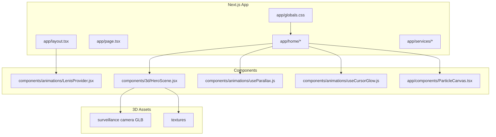
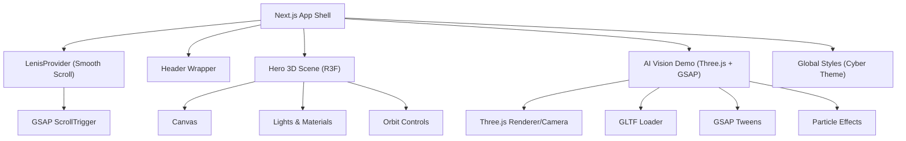
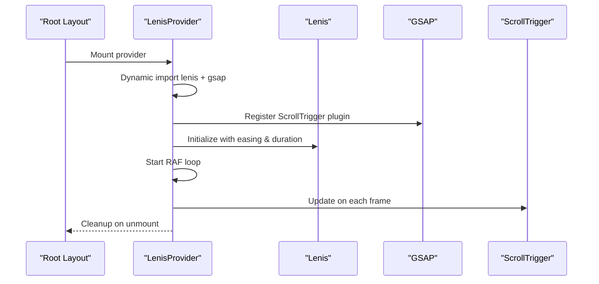
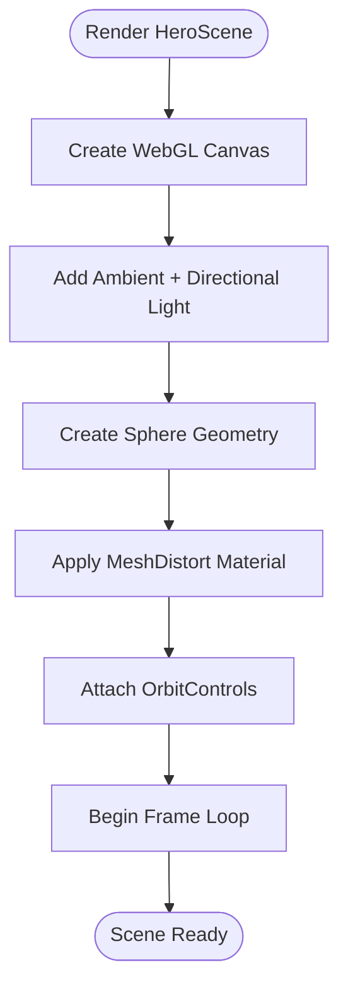
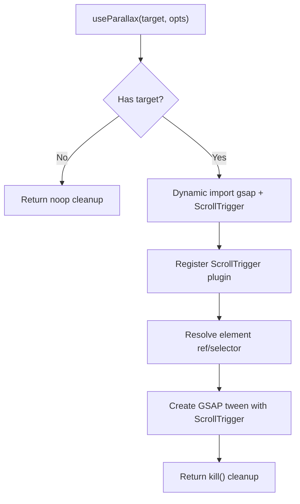
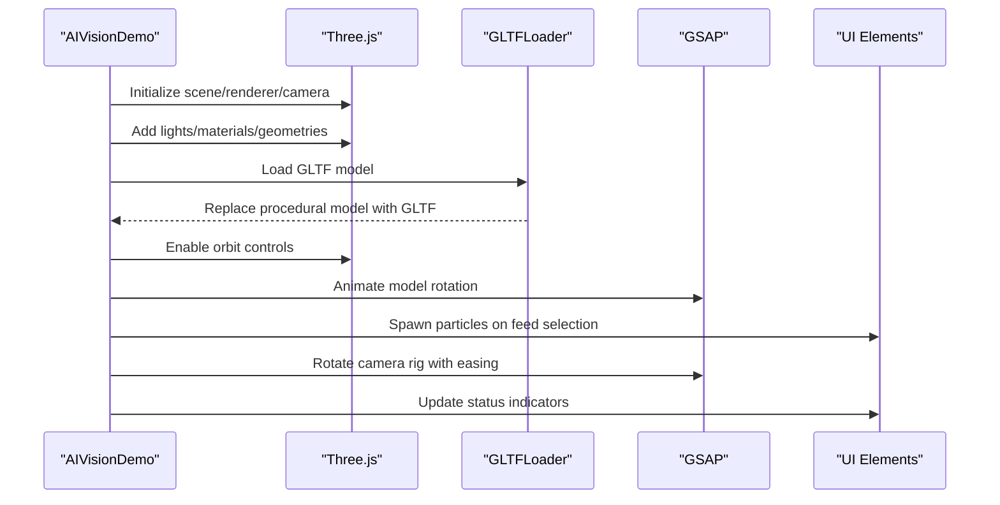
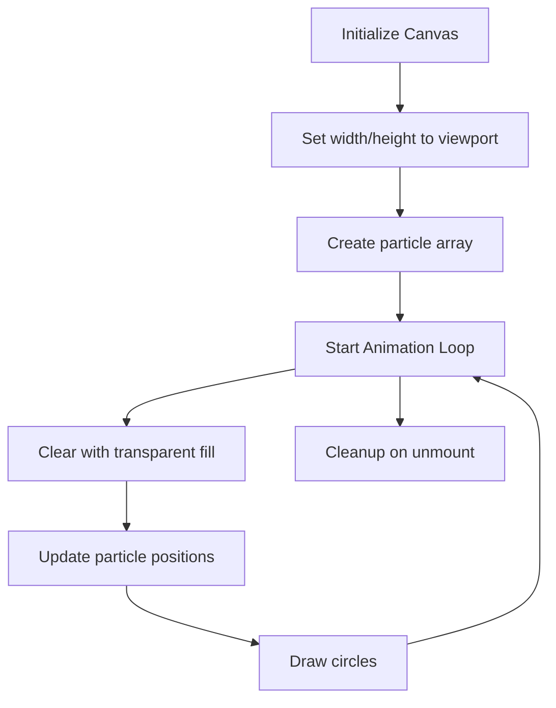
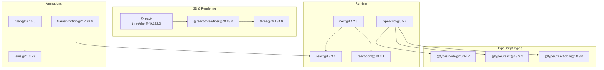

# Technology Stack & Dependencies

<cite>
**Referenced Files in This Document**
- [package.json](file://package.json)
- [tsconfig.json](file://tsconfig.json)
- [next-env.d.ts](file://next-env.d.ts)
- [README.md](file://README.md)
- [app/layout.tsx](file://app/layout.tsx)
- [components/animations/LenisProvider.jsx](file://components/animations/LenisProvider.jsx)
- [components/3d/HeroScene.jsx](file://components/3d/HeroScene.jsx)
- [components/animations/useParallax.js](file://components/animations/useParallax.js)
- [components/animations/useCursorGlow.js](file://components/animations/useCursorGlow.js)
- [app/home/AIVisionDemo.tsx](file://app/home/AIVisionDemo.tsx)
- [app/components/ParticleCanvas.tsx](file://app/components/ParticleCanvas.tsx)
- [app/globals.css](file://app/globals.css)
- [app/home/home.css](file://app/home/home.css)
- [app/services/page.tsx](file://app/services/page.tsx)
</cite>

## Table of Contents
1. [Introduction](#introduction)
2. [Project Structure](#project-structure)
3. [Core Technologies](#core-technologies)
4. [Architecture Overview](#architecture-overview)
5. [Detailed Component Analysis](#detailed-component-analysis)
6. [Dependency Analysis](#dependency-analysis)
7. [Performance Considerations](#performance-considerations)
8. [Troubleshooting Guide](#troubleshooting-guide)
9. [Conclusion](#conclusion)

## Introduction
This document provides a comprehensive technology stack and dependency analysis for the Zeex AI Main Website. The site is a modern, immersive showcase for an AI-powered surveillance platform, combining Next.js 14 as the React framework, TypeScript for type safety, and a rich ecosystem of libraries for 3D graphics, animations, and smooth scrolling. The stack emphasizes performance, interactivity, and a cohesive visual identity aligned with a futuristic surveillance theme.

## Project Structure
The project follows a Next.js 14 app directory structure with a focus on client-side interactivity and immersive UI:
- app/: Application pages, layouts, and global styles
- components/: Reusable UI and animation components
- public/: Static assets and media
- scripts/: Development and validation utilities
- node_modules/: Installed dependencies

**Diagram sources**
- [app/layout.tsx:1-24](file://app/layout.tsx#L1-L24)
- [components/animations/LenisProvider.jsx:1-52](file://components/animations/LenisProvider.jsx#L1-L52)
- [components/3d/HeroScene.jsx:1-37](file://components/3d/HeroScene.jsx#L1-L37)
- [components/animations/useParallax.js:1-31](file://components/animations/useParallax.js#L1-L31)
- [components/animations/useCursorGlow.js:1-26](file://components/animations/useCursorGlow.js#L1-L26)
- [app/components/ParticleCanvas.tsx:1-71](file://app/components/ParticleCanvas.tsx#L1-L71)

**Section sources**
- [README.md:476-518](file://README.md#L476-L518)

## Core Technologies
This section documents the primary technologies and their roles in delivering an immersive, high-performance website.

- Next.js 14 (React framework)
  - Provides app directory routing, server-side rendering, static generation, and image/font optimization.
  - Enables concurrent features and efficient builds for rapid iteration.
  - Version alignment ensures compatibility with React 18 and modern toolchains.

- TypeScript
  - Strict type checking improves developer productivity and reduces runtime errors.
  - Compiler options configured for modern JavaScript, isolated modules, and incremental builds.

- React 18
  - Latest concurrent features and automatic batching for smoother updates.
  - Hooks and effects power animations and 3D integrations.

- React Three Fiber + Three.js
  - React Three Fiber offers a declarative way to render 3D scenes with React components.
  - Three.js provides the underlying WebGL engine for lighting, materials, geometry, and camera controls.
  - Used for the hero 3D scene and the AI Vision demo camera rig.

- GSAP (GreenSock)
  - Advanced animation library for scroll-driven and interactive animations.
  - Integrated with Lenis for smooth scroll and ScrollTrigger for scroll-based timelines.
  - Powers particle effects, UI transitions, and camera movements in the demo.

- Lenis
  - Ultra-smooth scroll library that integrates with GSAP ScrollTrigger.
  - Provides customizable easing and frame-perfect synchronization with scroll events.

- Framer Motion
  - Motion primitives and gesture support for UI animations.
  - Used for hover states, transitions, and subtle micro-interactions across the site.

- Canvas Particles
  - Lightweight canvas-based particle system for background ambiance.
  - Runs independently of React to minimize re-renders and maximize performance.

**Section sources**
- [package.json:11-21](file://package.json#L11-L21)
- [tsconfig.json:1-40](file://tsconfig.json#L1-L40)
- [next-env.d.ts:1-6](file://next-env.d.ts#L1-L6)
- [app/layout.tsx:1-24](file://app/layout.tsx#L1-L24)
- [components/3d/HeroScene.jsx:1-37](file://components/3d/HeroScene.jsx#L1-L37)
- [components/animations/LenisProvider.jsx:1-52](file://components/animations/LenisProvider.jsx#L1-L52)
- [components/animations/useParallax.js:1-31](file://components/animations/useParallax.js#L1-L31)
- [components/animations/useCursorGlow.js:1-26](file://components/animations/useCursorGlow.js#L1-L26)
- [app/components/ParticleCanvas.tsx:1-71](file://app/components/ParticleCanvas.tsx#L1-L71)

## Architecture Overview
The architecture blends server-rendered Next.js pages with client-side immersive experiences:
- Layout initializes Lenis provider and header wrapper for consistent navigation.
- Hero 3D scene uses React Three Fiber to render a floating, distorted sphere with orbit controls.
- AI Vision demo composes Three.js camera, GLTF model loading, GSAP-driven animations, and particle effects.
- Global CSS defines a cohesive cyberpunk aesthetic with scanlines, grid overlays, and animated elements.
- Animations integrate Lenis smooth scroll with GSAP ScrollTrigger for scroll-driven motion.

**Diagram sources**
- [app/layout.tsx:1-24](file://app/layout.tsx#L1-L24)
- [components/animations/LenisProvider.jsx:1-52](file://components/animations/LenisProvider.jsx#L1-L52)
- [components/3d/HeroScene.jsx:1-37](file://components/3d/HeroScene.jsx#L1-L37)
- [app/home/AIVisionDemo.tsx:1-562](file://app/home/AIVisionDemo.tsx#L1-L562)
- [app/globals.css:1-800](file://app/globals.css#L1-L800)

## Detailed Component Analysis

### Lenis Smooth Scroll Provider
The LenisProvider dynamically imports Lenis and GSAP, registers ScrollTrigger, and synchronizes RAF updates with scroll events. This ensures silky-smooth scrolling and precise scroll-triggered animations.

**Diagram sources**
- [app/layout.tsx:6-6](file://app/layout.tsx#L6-L6)
- [components/animations/LenisProvider.jsx:1-52](file://components/animations/LenisProvider.jsx#L1-L52)

**Section sources**
- [components/animations/LenisProvider.jsx:1-52](file://components/animations/LenisProvider.jsx#L1-L52)
- [app/layout.tsx:6-6](file://app/layout.tsx#L6-L6)

### React Three Fiber Hero Scene
The HeroScene renders a low-poly sphere with floating and distortion effects, ambient and directional lighting, and orbit controls. It uses suspense for lazy-loading and sets camera parameters for optimal framing.

**Diagram sources**
- [components/3d/HeroScene.jsx:23-36](file://components/3d/HeroScene.jsx#L23-L36)

**Section sources**
- [components/3d/HeroScene.jsx:1-37](file://components/3d/HeroScene.jsx#L1-L37)

### GSAP Scroll-Driven Parallax
The useParallax helper asynchronously loads GSAP and ScrollTrigger, then applies a scroll-triggered parallax effect to a given element. It supports selectors or refs and returns a cleanup function.

**Diagram sources**
- [components/animations/useParallax.js:1-31](file://components/animations/useParallax.js#L1-L31)

**Section sources**
- [components/animations/useParallax.js:1-31](file://components/animations/useParallax.js#L1-L31)

### AI Vision Demo: Three.js + GSAP Integration
The AI Vision demo composes a Three.js scene with a camera rig, GLTF model loading, orbit controls, and GSAP-driven animations. It orchestrates particle bursts, UI feedback, and auto-cycling of input feeds.

**Diagram sources**
- [app/home/AIVisionDemo.tsx:38-213](file://app/home/AIVisionDemo.tsx#L38-L213)
- [app/home/AIVisionDemo.tsx:216-254](file://app/home/AIVisionDemo.tsx#L216-L254)
- [app/home/AIVisionDemo.tsx:337-437](file://app/home/AIVisionDemo.tsx#L337-L437)

**Section sources**
- [app/home/AIVisionDemo.tsx:1-562](file://app/home/AIVisionDemo.tsx#L1-L562)

### Canvas Particle System
The ParticleCanvas component creates a responsive particle field using HTML5 Canvas. It clears transparently each frame, updates positions, and handles resize events for consistent performance.

**Diagram sources**
- [app/components/ParticleCanvas.tsx:1-71](file://app/components/ParticleCanvas.tsx#L1-L71)

**Section sources**
- [app/components/ParticleCanvas.tsx:1-71](file://app/components/ParticleCanvas.tsx#L1-L71)

### Cursor Glow Enhancements
Optional lightweight helpers add cursor glow effects and parallax behaviors. These are integrated via CSS classes and minimal JS hooks to avoid heavy dependencies.

**Section sources**
- [components/animations/useCursorGlow.js:1-26](file://components/animations/useCursorGlow.js#L1-L26)
- [app/globals.css:429-444](file://app/globals.css#L429-L444)

## Dependency Analysis
This section maps core dependencies and their roles, along with version requirements and compatibility considerations.

**Diagram sources**
- [package.json:11-29](file://package.json#L11-L29)

**Section sources**
- [package.json:11-29](file://package.json#L11-L29)

### Version Requirements and Compatibility
- Next.js 14.2.5
  - Aligns with React 18 and provides app directory features.
  - Ensures compatibility with React DOM and SSR optimizations.

- React 18.3.1
  - Latest concurrent features and improved hydration.
  - Supports hooks and effects used across animations and 3D.

- TypeScript 5.5.4
  - Strict compiler options and incremental builds.
  - Type declarations for Next.js and React ecosystem.

- Three.js 0.184.0
  - Latest WebGL features and performance improvements.
  - Compatible with React Three Fiber and loaders.

- React Three Fiber 8.18.0
  - Declarative 3D with React components.
  - Integrates with Drei for helpers and controls.

- GSAP 3.15.0
  - ScrollTrigger for scroll-driven animations.
  - High-performance tweens and timeline control.

- Lenis 1.3.23
  - Smooth scroll with custom easing.
  - Seamless integration with GSAP ScrollTrigger.

- Framer Motion 12.38.0
  - Motion primitives and gesture support.
  - Optimized for React 18 with concurrent features.

**Section sources**
- [package.json:11-29](file://package.json#L11-L29)
- [tsconfig.json:1-40](file://tsconfig.json#L1-L40)

### Upgrade Paths and Alternatives
- Next.js
  - Prefer minor upgrades within 14.x for stability.
  - Major upgrades require thorough testing of app directory features and ISR/SSR behavior.

- React Three Fiber and Three.js
  - Keep versions aligned; newer Three.js versions may require updated R3F props or loaders.
  - Evaluate breaking changes in geometry/material APIs before upgrading.

- GSAP and Lenis
  - GSAP major versions often introduce new plugins or API changes; test ScrollTrigger configurations.
  - Lenis updates may alter easing curves or RAF behavior; validate scroll performance.

- Framer Motion
  - Minor updates typically safe; major versions may change internal DOM handling.
  - Verify animations still integrate with Lenis and GSAP as expected.

- TypeScript
  - Incremental upgrades recommended; strict mode helps catch regressions.
  - Ensure @types packages stay current with library versions.

**Section sources**
- [package.json:11-29](file://package.json#L11-L29)
- [tsconfig.json:1-40](file://tsconfig.json#L1-L40)

## Performance Considerations
- 3D Rendering
  - Use appropriate pixel ratio and anti-aliasing settings to balance quality and performance.
  - Limit draw calls by grouping geometries and reusing materials.
  - Disable unnecessary shadows and post-processing effects on lower-end devices.

- GSAP and ScrollTrigger
  - Prefer scrubbed animations for scroll-driven effects to reduce CPU usage.
  - Avoid animating expensive properties (e.g., layout-affecting CSS) when possible.

- Lenis
  - Tune duration and easing to match device capabilities.
  - Ensure RAF updates are canceled on unmount to prevent memory leaks.

- Canvas Particles
  - Resize handlers should throttle or debounce to avoid excessive recalculations.
  - Use transparent clears to minimize residual artifacts.

- Global Styles and Transforms
  - Leverage transform-style and will-change for GPU-accelerated animations.
  - Minimize repaints by avoiding frequent layout thrashing.

[No sources needed since this section provides general guidance]

## Troubleshooting Guide
- 3D Scene Not Rendering
  - Verify React Three Fiber and Three.js versions are installed.
  - Ensure Canvas is mounted and sized correctly; check suspense fallbacks.

- GSAP ScrollTrigger Not Activating
  - Confirm ScrollTrigger is registered after importing GSAP.
  - Validate trigger/scrub options and element visibility during scroll.

- Lenis Scroll Jank
  - Reduce easing complexity or duration.
  - Ensure RAF loop is properly canceled on unmount.

- Particle Canvas Issues
  - Confirm canvas element exists and resize handler runs on window resize.
  - Check for transparent clears and proper animation loop termination.

- Type Errors in TypeScript
  - Review tsconfig strictness and module resolution settings.
  - Ensure @types packages are installed and compatible with library versions.

**Section sources**
- [components/3d/HeroScene.jsx:1-37](file://components/3d/HeroScene.jsx#L1-L37)
- [components/animations/LenisProvider.jsx:1-52](file://components/animations/LenisProvider.jsx#L1-L52)
- [components/animations/useParallax.js:1-31](file://components/animations/useParallax.js#L1-L31)
- [app/components/ParticleCanvas.tsx:1-71](file://app/components/ParticleCanvas.tsx#L1-L71)
- [tsconfig.json:1-40](file://tsconfig.json#L1-L40)

## Conclusion
The Zeex AI Main Website leverages a modern, performance-conscious stack to deliver an immersive, visually compelling showcase for AI-powered surveillance solutions. Next.js 14 provides a robust foundation, while React Three Fiber and Three.js enable rich 3D experiences. GSAP and Lenis combine to produce smooth, scroll-driven animations, and Framer Motion enhances UI interactions. Together, these technologies create a cohesive, high-performance user experience aligned with the brand’s futuristic identity.